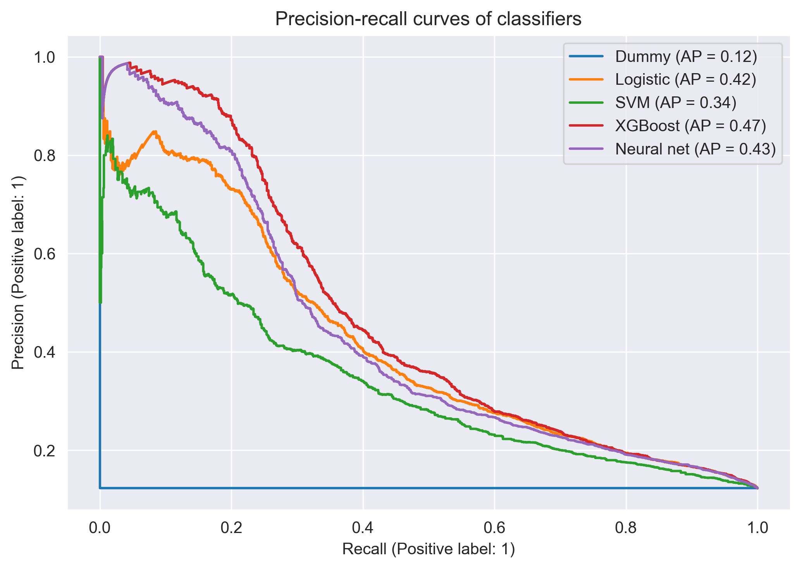
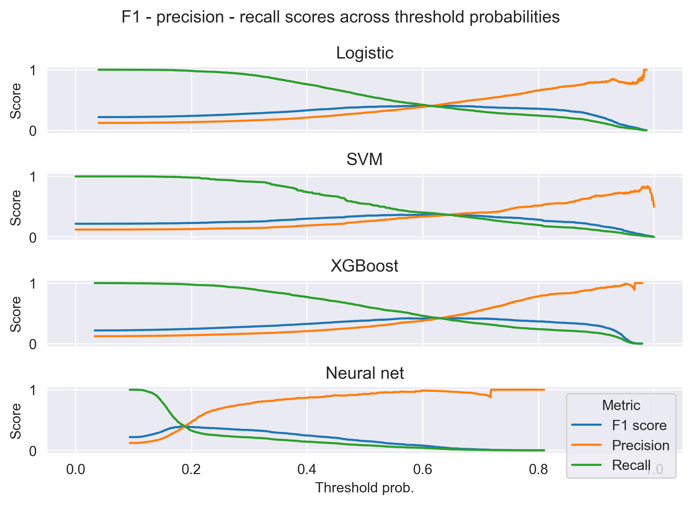
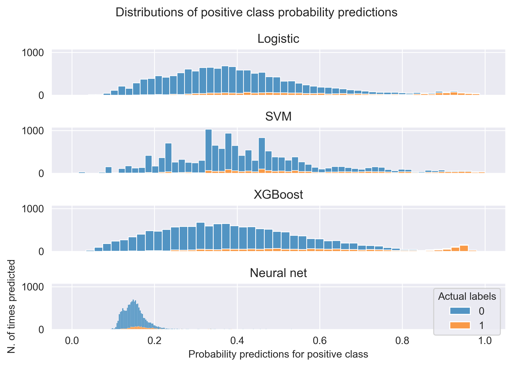
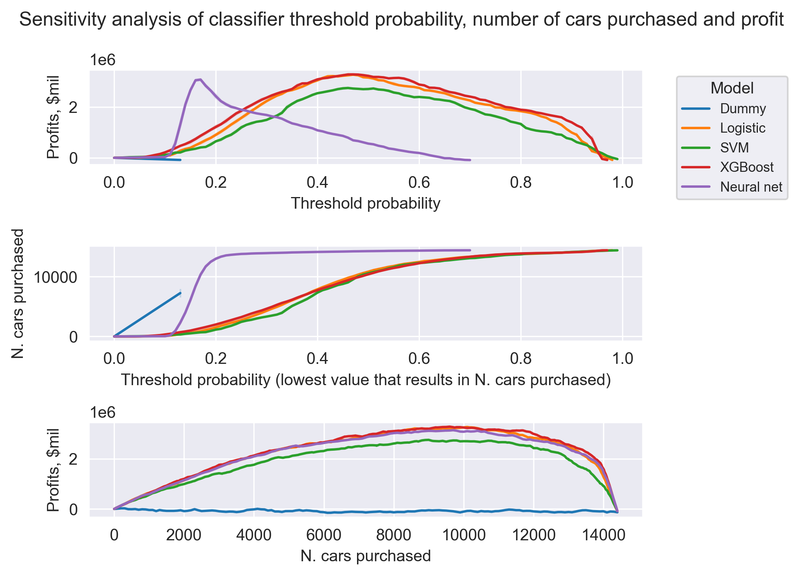

Imbalanced classification with deep learning - Used cars problem
================
Ahmet Zamanis

- <a href="#introduction" id="toc-introduction">Introduction</a>
- <a href="#setup" id="toc-setup">Setup</a>
- <a href="#data-cleaning" id="toc-data-cleaning">Data cleaning</a>
- <a href="#feature-engineering" id="toc-feature-engineering">Feature
  engineering</a>
- <a href="#preprocessing-pipeline"
  id="toc-preprocessing-pipeline">Preprocessing pipeline</a>
- <a href="#modeling-hyperparameter-optimization"
  id="toc-modeling-hyperparameter-optimization">Modeling &amp;
  hyperparameter optimization</a>
  - <a href="#logistic-regression-with-sgd"
    id="toc-logistic-regression-with-sgd">Logistic regression with SGD</a>
  - <a href="#support-vector-machine-with-sgd"
    id="toc-support-vector-machine-with-sgd">Support vector machine with
    SGD</a>
  - <a href="#xgboost" id="toc-xgboost">XGBoost</a>
  - <a href="#neural-network-with-pytorch"
    id="toc-neural-network-with-pytorch">Neural network with PyTorch</a>
- <a href="#model-testing" id="toc-model-testing">Model testing</a>
  - <a href="#training-prediction-with-final-models"
    id="toc-training-prediction-with-final-models">Training &amp; prediction
    with final models</a>
  - <a href="#calculating-performance-metrics"
    id="toc-calculating-performance-metrics">Calculating performance
    metrics</a>
  - <a href="#summary-table-of-performance-metrics"
    id="toc-summary-table-of-performance-metrics">Summary table of
    performance metrics</a>
  - <a href="#precision---recall-curves"
    id="toc-precision---recall-curves">Precision - recall curves</a>
  - <a href="#f1-score---precision---recall-plots"
    id="toc-f1-score---precision---recall-plots">F1 score - precision -
    recall plots</a>
  - <a href="#predicted-probability-distributions"
    id="toc-predicted-probability-distributions">Predicted probability
    distributions</a>
- <a href="#sensitivity-analysis"
  id="toc-sensitivity-analysis">Sensitivity analysis</a>
  - <a href="#problem-formulation" id="toc-problem-formulation">Problem
    formulation</a>
  - <a href="#calculations" id="toc-calculations">Calculations</a>
  - <a href="#plots-and-quasi-optimal-solutions"
    id="toc-plots-and-quasi-optimal-solutions">Plots and quasi-optimal
    solutions</a>
- <a href="#conclusions" id="toc-conclusions">Conclusions</a>

## Introduction

Classification, imbalanced data, loss functions. Deep learning & SGD

Dataset information and source

## Setup

<details>
<summary>Show packages</summary>

``` python
# Data handling
import pandas as pd
import numpy as np
from scipy.io.arff import loadarff

# Plotting
import matplotlib.pyplot as plt
import seaborn as sns

# Categorical encoding
from feature_engine.encoding import OneHotEncoder
from feature_engine.creation import CyclicalFeatures
from category_encoders.target_encoder import TargetEncoder

# Preprocessing pipeline
from sklearn.pipeline import Pipeline
from sklearn.preprocessing import MinMaxScaler
from sklearn.model_selection import train_test_split, StratifiedKFold

# Modeling
from sklearn.utils.class_weight import compute_class_weight
from sklearn.kernel_approximation import RBFSampler
from sklearn.calibration import CalibratedClassifierCV
from sklearn.dummy import DummyClassifier
from sklearn.linear_model import SGDClassifier
from xgboost import XGBClassifier

# Neural network modeling
import torch, torchvision, torchmetrics
import lightning.pytorch as pl
from optuna.integration.pytorch_lightning import PyTorchLightningPruningCallback

# Hyperparameter tuning 
import optuna

# Loss functions & performance metrics
from sklearn.metrics import log_loss
from sklearn.metrics import hinge_loss
from sklearn.metrics import average_precision_score, brier_score_loss
from sklearn.metrics import PrecisionRecallDisplay, precision_recall_curve

# Utilities
import warnings
from itertools import product
```

</details>
<details>
<summary>Show settings</summary>

``` python
# Set printing options
np.set_printoptions(suppress=True, precision=4)
pd.options.display.float_format = '{:.4f}'.format
pd.set_option('display.max_columns', None)

# Set plotting options
plt.rcParams['figure.dpi'] = 300
plt.rcParams['savefig.dpi'] = 300
plt.rcParams["figure.autolayout"] = True
sns.set_style("darkgrid")

# Set Torch settings
torch.set_default_dtype(torch.float32)
torch.set_float32_matmul_precision('high')
pl.seed_everything(1923, workers = True)
warnings.filterwarnings("ignore", ".*does not have many workers.*")
```

</details>

## Data cleaning

``` python
# Load raw data
raw_data = loadarff("./RawData/kick.arff")

# Convert to pandas dataframe
df = pd.DataFrame(raw_data[0])

# Print first & last 5 rows, all columns
print(df)
```

          IsBadBuy       PurchDate   Auction   VehYear  VehicleAge          Make   
    0         b'0' 1260144000.0000  b'ADESA' 2006.0000      3.0000      b'MAZDA'  \
    1         b'0' 1260144000.0000  b'ADESA' 2004.0000      5.0000      b'DODGE'   
    2         b'0' 1260144000.0000  b'ADESA' 2005.0000      4.0000      b'DODGE'   
    3         b'0' 1260144000.0000  b'ADESA' 2004.0000      5.0000      b'DODGE'   
    4         b'0' 1260144000.0000  b'ADESA' 2005.0000      4.0000       b'FORD'   
    ...        ...             ...       ...       ...         ...           ...   
    72978     b'1' 1259712000.0000  b'ADESA' 2001.0000      8.0000    b'MERCURY'   
    72979     b'0' 1259712000.0000  b'ADESA' 2007.0000      2.0000  b'CHEVROLET'   
    72980     b'0' 1259712000.0000  b'ADESA' 2005.0000      4.0000       b'JEEP'   
    72981     b'0' 1259712000.0000  b'ADESA' 2006.0000      3.0000  b'CHEVROLET'   
    72982     b'0' 1259712000.0000  b'ADESA' 2006.0000      3.0000      b'MAZDA'   

                             Model    Trim              SubModel      Color   
    0                    b'MAZDA3'    b'i'         b'4D SEDAN I'     b'RED'  \
    1       b'1500 RAM PICKUP 2WD'   b'ST'  b'QUAD CAB 4.7L SLT'   b'WHITE'   
    2                b'STRATUS V6'  b'SXT'   b'4D SEDAN SXT FFV'  b'MAROON'   
    3                      b'NEON'  b'SXT'           b'4D SEDAN'  b'SILVER'   
    4                     b'FOCUS'  b'ZX3'       b'2D COUPE ZX3'  b'SILVER'   
    ...                        ...     ...                   ...        ...   
    72978                 b'SABLE'   b'GS'        b'4D SEDAN GS'   b'BLACK'   
    72979             b'MALIBU 4C'   b'LS'        b'4D SEDAN LS'  b'SILVER'   
    72980  b'GRAND CHEROKEE 2WD V'  b'Lar'    b'4D WAGON LAREDO'  b'SILVER'   
    72981                b'IMPALA'   b'LS'        b'4D SEDAN LS'   b'WHITE'   
    72982                b'MAZDA6'    b's'         b'4D SEDAN S'  b'SILVER'   

          Transmission WheelTypeID  WheelType     VehOdo     Nationality   
    0          b'AUTO'        b'1'   b'Alloy' 89046.0000  b'OTHER ASIAN'  \
    1          b'AUTO'        b'1'   b'Alloy' 93593.0000     b'AMERICAN'   
    2          b'AUTO'        b'2'  b'Covers' 73807.0000     b'AMERICAN'   
    3          b'AUTO'        b'1'   b'Alloy' 65617.0000     b'AMERICAN'   
    4        b'MANUAL'        b'2'  b'Covers' 69367.0000     b'AMERICAN'   
    ...            ...         ...        ...        ...             ...   
    72978      b'AUTO'        b'1'   b'Alloy' 45234.0000     b'AMERICAN'   
    72979      b'AUTO'        b'?'       b'?' 71759.0000     b'AMERICAN'   
    72980      b'AUTO'        b'1'   b'Alloy' 88500.0000     b'AMERICAN'   
    72981      b'AUTO'        b'1'   b'Alloy' 79554.0000     b'AMERICAN'   
    72982      b'AUTO'        b'1'   b'Alloy' 66855.0000  b'OTHER ASIAN'   

                     Size TopThreeAmericanName  MMRAcquisitionAuctionAveragePrice   
    0           b'MEDIUM'             b'OTHER'                          8155.0000  \
    1      b'LARGE TRUCK'          b'CHRYSLER'                          6854.0000   
    2           b'MEDIUM'          b'CHRYSLER'                          3202.0000   
    3          b'COMPACT'          b'CHRYSLER'                          1893.0000   
    4          b'COMPACT'              b'FORD'                          3913.0000   
    ...               ...                  ...                                ...   
    72978       b'MEDIUM'              b'FORD'                          1996.0000   
    72979       b'MEDIUM'                b'GM'                          6418.0000   
    72980   b'MEDIUM SUV'          b'CHRYSLER'                          8545.0000   
    72981        b'LARGE'                b'GM'                          6420.0000   
    72982       b'MEDIUM'             b'OTHER'                          7535.0000   

           MMRAcquisitionAuctionCleanPrice  MMRAcquisitionRetailAveragePrice   
    0                            9829.0000                        11636.0000  \
    1                            8383.0000                        10897.0000   
    2                            4760.0000                         6943.0000   
    3                            2675.0000                         4658.0000   
    4                            5054.0000                         7723.0000   
    ...                                ...                               ...   
    72978                        2993.0000                         2656.0000   
    72979                        7325.0000                         7431.0000   
    72980                        9959.0000                         9729.0000   
    72981                        7604.0000                         7434.0000   
    72982                        8771.0000                         8638.0000   

           MMRAcquisitonRetailCleanPrice  MMRCurrentAuctionAveragePrice   
    0                         13600.0000                      7451.0000  \
    1                         12572.0000                      7456.0000   
    2                          8457.0000                      4035.0000   
    3                          5690.0000                      1844.0000   
    4                          8707.0000                      3247.0000   
    ...                              ...                            ...   
    72978                      3732.0000                      2190.0000   
    72979                      8411.0000                      6785.0000   
    72980                     11256.0000                      8375.0000   
    72981                      8712.0000                      6590.0000   
    72982                      9973.0000                      7730.0000   

           MMRCurrentAuctionCleanPrice  MMRCurrentRetailAveragePrice   
    0                        8552.0000                    11597.0000  \
    1                        9222.0000                    11374.0000   
    2                        5557.0000                     7146.0000   
    3                        2646.0000                     4375.0000   
    4                        4384.0000                     6739.0000   
    ...                            ...                           ...   
    72978                    3055.0000                     4836.0000   
    72979                    8132.0000                    10151.0000   
    72980                    9802.0000                    11831.0000   
    72981                    7684.0000                    10099.0000   
    72982                    9102.0000                    11954.0000   

           MMRCurrentRetailCleanPrice PRIMEUNIT AUCGUART     BYRNO    VNZIP1   
    0                      12409.0000      b'?'     b'?'  b'21973'  b'33619'  \
    1                      12791.0000      b'?'     b'?'  b'19638'  b'33619'   
    2                       8702.0000      b'?'     b'?'  b'19638'  b'33619'   
    3                       5518.0000      b'?'     b'?'  b'19638'  b'33619'   
    4                       7911.0000      b'?'     b'?'  b'19638'  b'33619'   
    ...                           ...       ...      ...       ...       ...   
    72978                   5937.0000      b'?'     b'?'  b'18111'  b'30212'   
    72979                  11652.0000      b'?'     b'?'  b'18881'  b'30212'   
    72980                  14402.0000      b'?'     b'?'  b'18111'  b'30212'   
    72981                  11228.0000      b'?'     b'?'  b'18881'  b'30212'   
    72982                  13246.0000      b'?'     b'?'  b'18111'  b'30212'   

            VNST  VehBCost IsOnlineSale  WarrantyCost  
    0      b'FL' 7100.0000         b'0'     1113.0000  
    1      b'FL' 7600.0000         b'0'     1053.0000  
    2      b'FL' 4900.0000         b'0'     1389.0000  
    3      b'FL' 4100.0000         b'0'      630.0000  
    4      b'FL' 4000.0000         b'0'     1020.0000  
    ...      ...       ...          ...           ...  
    72978  b'GA' 4200.0000         b'0'      993.0000  
    72979  b'GA' 6200.0000         b'0'     1038.0000  
    72980  b'GA' 8200.0000         b'0'     1893.0000  
    72981  b'GA' 7000.0000         b'0'     1974.0000  
    72982  b'GA' 8000.0000         b'0'     1313.0000  

    [72983 rows x 33 columns]

``` python
# Convert object columns from bytes to string datatype
object_cols = df.select_dtypes(["object"]).columns

for column in object_cols:
  df[column] = df[column].apply(lambda x: x.decode("utf-8"))
del column


# Replace "?" string values with NAs
for column in object_cols:
  df.loc[df[column] == "?", column] = np.nan
del column
```

``` python
# Print n. of missing values in each column
pd.isnull(df).sum()
```

    IsBadBuy                                 0
    PurchDate                                0
    Auction                                  0
    VehYear                                  0
    VehicleAge                               0
    Make                                     0
    Model                                    0
    Trim                                  2360
    SubModel                                 8
    Color                                    8
    Transmission                             9
    WheelTypeID                           3169
    WheelType                             3174
    VehOdo                                   0
    Nationality                              5
    Size                                     5
    TopThreeAmericanName                     5
    MMRAcquisitionAuctionAveragePrice       18
    MMRAcquisitionAuctionCleanPrice         18
    MMRAcquisitionRetailAveragePrice        18
    MMRAcquisitonRetailCleanPrice           18
    MMRCurrentAuctionAveragePrice          315
    MMRCurrentAuctionCleanPrice            315
    MMRCurrentRetailAveragePrice           315
    MMRCurrentRetailCleanPrice             315
    PRIMEUNIT                            69564
    AUCGUART                             69564
    BYRNO                                    0
    VNZIP1                                   0
    VNST                                     0
    VehBCost                                68
    IsOnlineSale                             0
    WarrantyCost                             0
    dtype: int64

``` python
print("Target class (im)balance: ")
df["IsBadBuy"].value_counts(normalize = True)
```

    Target class (im)balance: 

    IsBadBuy
    0   0.8770
    1   0.1230
    Name: proportion, dtype: float64

``` python
# Purchase date is in UNIX timestamp format. Convert to datetime
df["PurchDate"]
df["PurchDate"] = pd.to_datetime(df["PurchDate"], unit = "s")
```

``` python
# 3 unique auctioneers. ADESA, MANHEIM and other. Mostly MANHEIM.
df["Auction"].value_counts(normalize = True)
```

    Auction
    MANHEIM   0.5624
    OTHER     0.2398
    ADESA     0.1978
    Name: proportion, dtype: float64

``` python
# Vehicle years range from 2001 to 2010
print(df[["VehYear", "VehicleAge"]].describe())

# Purchase age almost always matches PurchYear - VehYear.
purch_year = df["PurchDate"].dt.year
veh_year = df["VehYear"]

print("\nCases where purchase year - vehicle year = vehicle age: " + str(((purch_year - veh_year) == df["VehicleAge"]).sum()))
```

             VehYear  VehicleAge
    count 72983.0000  72983.0000
    mean   2005.3431      4.1766
    std       1.7313      1.7122
    min    2001.0000      0.0000
    25%    2004.0000      3.0000
    50%    2005.0000      4.0000
    75%    2007.0000      5.0000
    max    2010.0000      9.0000

    Cases where purchase year - vehicle year = vehicle age: 72976

``` python
# There are brands with very few observations.
print(df["Make"].value_counts())

# Recode TOYOTA SCION into SCION
df.loc[df["Make"] == "TOYOTA SCION", "Make"] = "SCION"
```

    Make
    CHEVROLET       17248
    DODGE           12912
    FORD            11305
    CHRYSLER         8844
    PONTIAC          4258
    KIA              2484
    SATURN           2163
    NISSAN           2085
    HYUNDAI          1811
    JEEP             1644
    SUZUKI           1328
    TOYOTA           1144
    MITSUBISHI       1030
    MAZDA             979
    MERCURY           913
    BUICK             720
    GMC               649
    HONDA             497
    OLDSMOBILE        243
    VOLKSWAGEN        134
    ISUZU             134
    SCION             129
    LINCOLN            97
    INFINITI           42
    VOLVO              37
    CADILLAC           33
    ACURA              33
    LEXUS              31
    SUBARU             28
    MINI               24
    PLYMOUTH            2
    TOYOTA SCION        1
    HUMMER              1
    Name: count, dtype: int64

``` python
# There are 1063 unique models, many with only 1 observation.
df["Model"].value_counts() 
```

    Model
    PT CRUISER              2329
    IMPALA                  1990
    TAURUS                  1425
    CALIBER                 1375
    CARAVAN GRAND FWD V6    1289
                            ... 
    ESCAPE                     1
    PRIZM 1.8L I-4 SFI D       1
    CAMRY V6 3.0L / 3.3L       1
    LHS                        1
    PATRIOT 2WD 4C 2.0L        1
    Name: count, Length: 1063, dtype: int64

``` python
# 134 trims, many with only 1 observation. 2360 missing values.
df["Trim"].value_counts() 
```

    Trim
    Bas    13950
    LS     10174
    SE      9348
    SXT     3825
    LT      3540
           ...  
    Har        1
    LL         1
    JLX        1
    JLS        1
    L 3        1
    Name: count, Length: 134, dtype: int64

``` python
# 863 submodels, many with only 1 observation. 8 missing values.
df["SubModel"].value_counts() 
```

    SubModel
    4D SEDAN                  15236
    4D SEDAN LS                4718
    4D SEDAN SE                3859
    4D WAGON                   2230
    MINIVAN 3.3L               1258
                              ...  
    EXT CAB 5.4L FX2 SPORT        1
    2D COUPE ZX5 S                1
    4D WAGON OUTBACK              1
    EXT CAB 6.0L SLE              1
    MINIVAN 3.3L FFV EL           1
    Name: count, Length: 863, dtype: int64

``` python
# 2784 unique model & submodel combinations, many with only 1 observation.
(df["Model"] + " " + df["SubModel"]).value_counts()
```

    PT CRUISER 4D SEDAN                            1894
    IMPALA 4D SEDAN LS                             1300
    CALIBER 4D WAGON                               1097
    PT CRUISER 2.4L I4 S 4D SEDAN                   957
    STRATUS V6 2.7L V6 M 4D SEDAN SXT FFV           770
                                                   ... 
    F150 PICKUP 2WD V8 5 REG CAB 5.4L W/T             1
    VIBE 4D WAGON 2.4L                                1
    XL-7 4WD 2.7L V6 MPI 4D SPORT UTILITY             1
    F150 PICKUP 4WD V8 CREW CAB 5.4L KING RANCH       1
    PATRIOT 2WD 4C 2.0L 4D SUV SPORT                  1
    Name: count, Length: 2784, dtype: int64

``` python
# 3000+ unique cars in dataset (some could be different namings / spellings of the same car)
(df["Model"] + df["Trim"] + df["SubModel"]).value_counts()
```

    PT CRUISERBas4D SEDAN                          1355
    IMPALALS4D SEDAN LS                            1300
    CALIBERSE4D WAGON                               939
    STRATUS V6 2.7L V6 MSXT4D SEDAN SXT FFV         770
    TAURUSSE4D SEDAN SE                             761
                                                   ... 
    CIVICVP2D COUPE DX VALUE PACKAGE AUTO             1
    2500 RAM PICKUP 2WDLarQUAD CAB 5.7L LARAMIE       1
    DURANGO 4WD V8Lim4D SUV 4.7L FFV LIMITED          1
    LEGACYL4D WAGON L                                 1
    PATRIOT 2WD 4C 2.0LSpo4D SUV SPORT                1
    Name: count, Length: 3136, dtype: int64

``` python
# 8 missing values for color, recode them as NOT AVAIL
print(df["Color"].value_counts())
df.loc[pd.isna(df["Color"]), "Color"] = "NOT AVAIL"
```

    Color
    SILVER       14875
    WHITE        12123
    BLUE         10347
    GREY          7887
    BLACK         7627
    RED           6257
    GOLD          5231
    GREEN         3194
    MAROON        2046
    BEIGE         1584
    BROWN          436
    ORANGE         415
    PURPLE         373
    YELLOW         244
    OTHER          242
    NOT AVAIL       94
    Name: count, dtype: int64

``` python
# 9 missing values from transmission. Try to work them out from car model. 1 occurence of manual spelled differently.
print(df["Transmission"].value_counts())

# Replace "Manual" with MANUAL in transmission
df.loc[df["Transmission"] == "Manual", "Transmission"] = "MANUAL"
```

    Transmission
    AUTO      70398
    MANUAL     2575
    Manual        1
    Name: count, dtype: int64

``` python
# Work out & impute transmission NAs from car model
print("Rows with Transmission values missing: ")
print(df.loc[pd.isna(df["Transmission"]), ["VehYear", "Make", "Model", "Trim", "SubModel"]])

transmission_nas = ["AUTO", "MANUAL", "MANUAL", "MANUAL", "AUTO", "MANUAL", "MANUAL", "AUTO", "AUTO"]
  
df.loc[pd.isna(df["Transmission"]), "Transmission"] = transmission_nas
```

    Rows with Transmission values missing: 
            VehYear       Make                 Model Trim         SubModel
    15906 2005.0000    MERCURY   MONTEGO 3.0L V6 EFI  Bas  4D SEDAN LUXURY
    24567 2006.0000      DODGE  STRATUS V6 2.7L V6 M  SXT              NaN
    24578 2006.0000      DODGE  STRATUS V6 2.7L V6 M  SXT              NaN
    70432 2001.0000  CHEVROLET  S10 PICKUP 2WD 4C 2.  Bas              NaN
    70434 2004.0000  CHEVROLET    IMPALA 3.4L V6 SFI  Bas              NaN
    70437 2004.0000    PONTIAC   GRAND AM V6 3.4L V6   SE              NaN
    70445 2002.0000  CHEVROLET   CAVALIER 4C 2.2L I4  Bas              NaN
    70446 2002.0000    MERCURY  MOUNTAINEER 2WD V8 4  NaN              NaN
    70450 2006.0000       FORD  FREESTAR FWD V6 3.9L   SE              NaN

``` python
# 3169 missing values in WheelTypeID, 3174 in WheelType. Crosscheck these columns.
print(df["WheelTypeID"].value_counts())
print("\n")
print(df["WheelType"].value_counts())
```

    WheelTypeID
    1    36050
    2    33004
    3      755
    0        5
    Name: count, dtype: int64


    WheelType
    Alloy      36050
    Covers     33004
    Special      755
    Name: count, dtype: int64

``` python
print("N. of WheelTypeID NAs that are also WheelType NAs: " + 
str(pd.isnull(df.loc[pd.isnull(df["WheelTypeID"]), "WheelType"]).sum())
)

print("Remaining 5 rows with WheelType NAs are WheelTypeID = 0: ")
df.loc[df["WheelTypeID"] == "0", "WheelType"]
```

    N. of WheelTypeID NAs that are also WheelType NAs: 3169
    Remaining 5 rows with WheelType NAs are WheelTypeID = 0: 

    2992     NaN
    3926     NaN
    42640    NaN
    47731    NaN
    69331    NaN
    Name: WheelType, dtype: object

``` python
print("Cases where WheelTypeID 1 = WheelType Alloy: " + str(
  (df.loc[df["WheelTypeID"] == "1", "WheelType"] == "Alloy").sum()
))

print("Cases where WheelTypeID 2 = WheelType Covers: " + str(
  (df.loc[df["WheelTypeID"] == "2", "WheelType"] == "Covers").sum()
))

print("Cases where WheelTypeID 3 = WheelType Special: " + str(
  (df.loc[df["WheelTypeID"] == "3", "WheelType"] == "Special").sum()
))
```

    Cases where WheelTypeID 1 = WheelType Alloy: 36050
    Cases where WheelTypeID 2 = WheelType Covers: 33004
    Cases where WheelTypeID 3 = WheelType Special: 755

``` python
# Recode WheelType NAs as Other, drop WheelTypeID column
df.loc[pd.isnull(df["WheelType"]), "WheelType"] = "Other"
df = df.drop("WheelTypeID", axis = 1)
```

``` python
# 5 missing values in Nationality. Work these out from car make. 
df["Nationality"].value_counts()
```

    Nationality
    AMERICAN          61028
    OTHER ASIAN        8033
    TOP LINE ASIAN     3722
    OTHER               195
    Name: count, dtype: int64

``` python
# Work out the 5 missing Nationality values from make
print("Makes of rows with missing Nationality values: ")
print(df.loc[pd.isnull(df["Nationality"]), "Make"])
nationality_nas = ["AMERICAN", "AMERICAN", "OTHER ASIAN", "AMERICAN", "AMERICAN"]
df.loc[pd.isnull(df["Nationality"]), "Nationality"] = nationality_nas
```

    Makes of rows with missing Nationality values: 
    10888        GMC
    25169      DODGE
    37986    HYUNDAI
    69948       JEEP
    69958       JEEP
    Name: Make, dtype: object

``` python
# 5 missing values in size. Work these out from the model.
df["Size"].value_counts()
```

    Size
    MEDIUM         30785
    LARGE           8850
    MEDIUM SUV      8090
    COMPACT         7205
    VAN             5854
    LARGE TRUCK     3170
    SMALL SUV       2276
    SPECIALTY       1915
    CROSSOVER       1759
    LARGE SUV       1433
    SMALL TRUCK      864
    SPORTS           777
    Name: count, dtype: int64

``` python
# Work out the 5 missing Size values from make & model
print("Rows with Size values missing: ")
print(df.loc[pd.isnull(df["Size"]), ["VehYear", "Make", "Model"]])

print("\nSize values of other rows with same model: ")
print(df.loc[df["Model"].str.contains("SIERRA"), "Size"].iloc[0] + "\n" +
df.loc[df["Model"].str.contains("NITRO 4WD"), "Size"].iloc[0] + "\n" +
df.loc[df["Model"].str.contains("ELANTRA"), "Size"].iloc[0] + "\n" +
df.loc[df["Model"].str.contains("PATRIOT 2WD"), "Size"].iloc[0])

size_nas = ["LARGE TRUCK", "MEDIUM SUV", "MEDIUM", "SMALL SUV", "SMALL SUV"]
df.loc[pd.isnull(df["Size"]), "Size"] = size_nas
```

    Rows with Size values missing: 
            VehYear     Make                Model
    10888 2002.0000      GMC          SIERRA 1500
    25169 2008.0000    DODGE         NITRO 4WD V6
    37986 2006.0000  HYUNDAI  ELANTRA 2.0L I4 MPI
    69948 2008.0000     JEEP       PATRIOT 2WD 4C
    69958 2008.0000     JEEP       PATRIOT 2WD 4C

    Size values of other rows with same model: 
    LARGE TRUCK
    MEDIUM SUV
    MEDIUM
    SMALL SUV

``` python
# Unnecessary column, information already incorporated in Make. Drop it
print(df["TopThreeAmericanName"].value_counts())
df = df.drop("TopThreeAmericanName", axis = 1)
```

    TopThreeAmericanName
    GM          25314
    CHRYSLER    23399
    FORD        12315
    OTHER       11950
    Name: count, dtype: int64

``` python
print("Missing values in MMR columns:")
print(pd.isnull(df[['MMRAcquisitionAuctionAveragePrice', 'MMRAcquisitionAuctionCleanPrice',
       'MMRAcquisitionRetailAveragePrice', 'MMRAcquisitonRetailCleanPrice',
       'MMRCurrentAuctionAveragePrice', 'MMRCurrentAuctionCleanPrice',
       'MMRCurrentRetailAveragePrice', 'MMRCurrentRetailCleanPrice']]).sum())
       
# Drop current MMR prices to make the exercise more realistic
df = df.drop([
  'MMRCurrentAuctionAveragePrice', 'MMRCurrentAuctionCleanPrice',
  'MMRCurrentRetailAveragePrice', 'MMRCurrentRetailCleanPrice'], axis = 1)
```

    Missing values in MMR columns:
    MMRAcquisitionAuctionAveragePrice     18
    MMRAcquisitionAuctionCleanPrice       18
    MMRAcquisitionRetailAveragePrice      18
    MMRAcquisitonRetailCleanPrice         18
    MMRCurrentAuctionAveragePrice        315
    MMRCurrentAuctionCleanPrice          315
    MMRCurrentRetailAveragePrice         315
    MMRCurrentRetailCleanPrice           315
    dtype: int64

``` python
# Some MMR values are zero
print("N. of rows with at least one MMR value of 0: " + 
      str(len(df.loc[
        (df["MMRAcquisitionAuctionAveragePrice"] == 0) |
        (df["MMRAcquisitionAuctionCleanPrice"] == 0) |
        (df["MMRAcquisitionRetailAveragePrice"] == 0) |
        (df["MMRAcquisitonRetailCleanPrice"] == 0)
        ]))) 


# Some MMR values are one
print("N. of rows with at least one MMR value of 1: " + 
      str(len(df.loc[
        (df["MMRAcquisitionAuctionAveragePrice"] == 1) |
        (df["MMRAcquisitionAuctionCleanPrice"] == 1) |
        (df["MMRAcquisitionRetailAveragePrice"] == 1) |
        (df["MMRAcquisitonRetailCleanPrice"] == 1)
       ]))) 

  
# Drop rows with NAs in MMR
df = df.dropna(subset = [
  'MMRAcquisitionAuctionAveragePrice', 'MMRAcquisitionAuctionCleanPrice',
  'MMRAcquisitionRetailAveragePrice', 'MMRAcquisitonRetailCleanPrice'])

# Drop rows with 0s in MMR
df = df.loc[(df["MMRAcquisitionAuctionAveragePrice"] > 0) &
  (df["MMRAcquisitionAuctionCleanPrice"] > 0) &
  (df["MMRAcquisitionRetailAveragePrice"] > 0) &
  (df["MMRAcquisitonRetailCleanPrice"] > 0)].copy()
```

    N. of rows with at least one MMR value of 0: 828
    N. of rows with at least one MMR value of 1: 131

``` python
# 95% missing column. Missing values possibly mean NO. YES means there was unusual
# demand for the car.
print(df["PRIMEUNIT"].value_counts(normalize = True))

# Fill NAs in PRIMEUNIT with UNKNOWN.
df.loc[pd.isnull(df["PRIMEUNIT"]), "PRIMEUNIT"] = "UNKNOWN"
```

    PRIMEUNIT
    NO    0.9817
    YES   0.0183
    Name: proportion, dtype: float64

``` python
# 95% missing column. AUCGUART is the vehicle inspection level at auction. Green
# means inspected, yellow means partial information available, red means you buy what you see. Could assume yellow for missing values.
print(df["AUCGUART"].value_counts(normalize = True))

# Fill NAs in AUCGUART with UNKNOWN.
df.loc[pd.isnull(df["AUCGUART"]), "AUCGUART"] = "UNKNOWN"
```

    AUCGUART
    GREEN   0.9770
    RED     0.0230
    Name: proportion, dtype: float64

``` python
# BYRNO is buyer no. 74 unique buyers, some with only 1 observation.
df["BYRNO"].value_counts()
```

    BYRNO
    99761    3896
    18880    3553
    835      2951
    3453     2888
    22916    2795
             ... 
    99741       1
    1157        1
    3582        1
    10425       1
    1086        1
    Name: count, Length: 74, dtype: int64

``` python
# VNZIP1 is zipcode of purchase location, 153 locations, some with only 1 obs.
df["VNZIP1"].value_counts()
```

    VNZIP1
    32824    3676
    27542    3368
    75236    2410
    74135    2286
    80022    2097
             ... 
    76101       1
    85248       1
    85260       1
    80112       1
    25071       1
    Name: count, Length: 153, dtype: int64

``` python
# VNST is purchase state.
df["VNST"].value_counts()
```

    VNST
    TX    13482
    FL    10318
    CA     7009
    NC     6971
    AZ     6102
    CO     4938
    SC     4232
    OK     3552
    GA     2425
    TN     1737
    VA     1652
    MD     1124
    UT      870
    PA      806
    OH      793
    MO      752
    AL      684
    NV      542
    MS      488
    IN      486
    IA      482
    IL      454
    LA      347
    NJ      317
    WV      291
    NM      237
    KY      228
    OR      208
    ID      187
    WA      135
    NH       97
    AR       68
    MN       62
    NE       26
    MA       15
    MI       14
    NY        6
    Name: count, dtype: int64

``` python
# VehBCost is purchase price. 68 missing values, drop these rows. One car has a purchase price of 1.
df["VehBCost"].describe()
df = df.dropna(subset = "VehBCost")
```

``` python
# Warranty cost is for 36 months, or until 36k miles
df["WarrantyCost"].describe()
```

    count   72069.0000
    mean     1276.4975
    std       597.7557
    min       462.0000
    25%       837.0000
    50%      1169.0000
    75%      1623.0000
    max      7498.0000
    Name: WarrantyCost, dtype: float64

## Feature engineering

``` python
# Time features from date: Purchase year, month, day of week
df["PurchaseYear"] = df["PurchDate"].dt.year
df["PurchaseMonth"] = df["PurchDate"].dt.month
df["PurchaseDay"] = df["PurchDate"].dt.weekday
df = df.drop("PurchDate", axis = 1)
```

``` python
# Engine type features from Model: V6, V8, I4/I-4, 4C, 6C
df["EngineV6"] = df["Model"].str.contains("V6").astype(int)
df["EngineV8"] = df["Model"].str.contains("V8").astype(int)
df["EngineI4"] = df["Model"].str.contains("I4|I-4", regex = True).astype(int)
df["Engine4C"] = df["Model"].str.contains("4C").astype(int)
df["Engine6C"] = df["Model"].str.contains("6C").astype(int)

# Drivetrain type features from Model: 2WD, 4WD, AWD, FWD, RWD
df["2WD"] = df["Model"].str.contains("2WD").astype(int)
df["4WD"] = df["Model"].str.contains("4WD").astype(int)
df["AWD"] = df["Model"].str.contains("AWD").astype(int)
df["FWD"] = df["Model"].str.contains("FWD").astype(int)
df["RWD"] = df["Model"].str.contains("RWD").astype(int)
```

``` python
# Chassis type features from SubModel: WAGON, SEDAN, COUPE, HATCHBACK, CONVERTIBLE
# Work out and recode these features manually for rows where SubModel is missing
print("Rows where SubModel is missing:")
print(df.loc[pd.isnull(df["SubModel"]), "Model"])

df["ChassisWagon"] = df["SubModel"].str.contains("WAGON")
df.loc[pd.isnull(df["ChassisWagon"]), "ChassisWagon"] = [
  False, False, False, False, False, False, False, True]
df["ChassisWagon"] = df["ChassisWagon"].astype(int)

df["ChassisSedan"] = df["SubModel"].str.contains("SEDAN")
df.loc[pd.isnull(df["ChassisSedan"]), "ChassisSedan"] = [
  True, True, False, True, True, True, False, False]
df["ChassisSedan"] = df["ChassisSedan"].astype(int)

df["ChassisCoupe"] = df["SubModel"].str.contains("COUPE")
df.loc[pd.isnull(df["ChassisCoupe"]), "ChassisCoupe"] = False
df["ChassisCoupe"] = df["ChassisCoupe"].astype(int)

df["ChassisHatch"] = df["SubModel"].str.contains("HATCHBACK")
df.loc[pd.isnull(df["ChassisHatch"]), "ChassisHatch"] = False
df["ChassisHatch"] = df["ChassisHatch"].astype(int)

df["ChassisConvertible"] = df["SubModel"].str.contains("CONVERTIBLE")
df.loc[pd.isnull(df["ChassisConvertible"]), "ChassisConvertible"] = False
df["ChassisConvertible"] = df["ChassisConvertible"].astype(int)
```

    Rows where SubModel is missing:
    24567    STRATUS V6 2.7L V6 M
    24578    STRATUS V6 2.7L V6 M
    70432    S10 PICKUP 2WD 4C 2.
    70434      IMPALA 3.4L V6 SFI
    70437     GRAND AM V6 3.4L V6
    70445     CAVALIER 4C 2.2L I4
    70446    MOUNTAINEER 2WD V8 4
    70450    FREESTAR FWD V6 3.9L
    Name: Model, dtype: object

``` python
# Door type feature from SubModel: 4D
df["FourDoors"] = df["SubModel"].str.contains("4D")

# Work out and recode this feature manually for rows where SubModel is missing (displayed in previous cell)
df.loc[pd.isnull(df["FourDoors"]), "FourDoors"] = [
  True, True, False, True, True, True, False, False]
df["FourDoors"] = df["FourDoors"].astype(int)
```

``` python
# Recode SubModel NAs into empty string
df.loc[pd.isnull(df["SubModel"]), "SubModel"] = ""

# Combine Model & SubModel as one feature
df["ModelSubModel"] = df["Model"] + " " + df["SubModel"]

# Drop trim, submodel
df = df.drop(["Trim", "SubModel"], axis = 1)
```

``` python
# Miles per year feature
df["MilesPerYear"] = df["VehOdo"] / df["VehicleAge"]
df.loc[df["MilesPerYear"] == np.inf, "MilesPerYear"] = df["VehOdo"] # Replace inf values raised when vehicle age = 0
```

``` python
# Premiums / discounts paid on MMR prices: VehBCost - MMR price / MMR price
df["PremiumAuctionAvg"] = (df["VehBCost"] - df["MMRAcquisitionAuctionAveragePrice"]) / df["MMRAcquisitionAuctionAveragePrice"]

df["PremiumAuctionClean"] = (df["VehBCost"] - df["MMRAcquisitionAuctionCleanPrice"]) / df["MMRAcquisitionAuctionCleanPrice"]

df["PremiumRetailAvg"] = (df["VehBCost"] - df["MMRAcquisitionRetailAveragePrice"]) / df["MMRAcquisitionRetailAveragePrice"]
  
df["PremiumRetailClean"] = (df["VehBCost"] - df["MMRAcquisitonRetailCleanPrice"]) / df["MMRAcquisitonRetailCleanPrice"]
```

``` python
# Warranty ratio to purchase price
df["WarrantyRatio"] = df["WarrantyCost"] / df["VehBCost"]

# The observation with purchase price = 1 skews the WarrantyRatio feature greatly. Drop it.
print(df[["VehBCost", "WarrantyRatio"]].sort_values(by = "WarrantyRatio", ascending = False).iloc[0])
df = df.loc[df["VehBCost"] != 1].copy()
```

    VehBCost           1.0000
    WarrantyRatio   1590.0000
    Name: 20442, dtype: float64

``` python
# One hot encode some categoricals in-place
encoder_onehot = OneHotEncoder(
  drop_last = True, # Create N-1 binary columns to encode N categorical levels
  drop_last_binary = True,
  variables = ['Auction', 'VehYear', 'Color', 'Transmission', 'WheelType', 
  'Nationality', 'Size', 'PurchaseYear'],
  ignore_format = True)
df = encoder_onehot.fit_transform(df)

# One hot encode PRIMEUNIT and AUCGUART only using known values (effectively making "unknown" the default / 0 case)
df["PRIMEUNIT_YES"] = (df["PRIMEUNIT"] == "YES").astype(int)
df["PRIMEUNIT_NO"] = (df["PRIMEUNIT"] == "NO").astype(int)
df["AUCGUART_GREEN"] = (df["AUCGUART"] == "GREEN").astype(int)
df["AUCGUART_RED"] = (df["AUCGUART"] == "RED").astype(int)
df = df.drop(["PRIMEUNIT", "AUCGUART"], axis = 1)
```

``` python
# Cyclical encode month and day of week features
encoder_cyclical = CyclicalFeatures(
  variables = ["PurchaseMonth", "PurchaseDay"], drop_original = True)
df = encoder_cyclical.fit_transform(df)
```

``` python
# View final feature set before preprocessing
print(df.head())
```

      IsBadBuy  VehicleAge   Make                Model     VehOdo   
    0        0      3.0000  MAZDA               MAZDA3 89046.0000  \
    1        0      5.0000  DODGE  1500 RAM PICKUP 2WD 93593.0000   
    2        0      4.0000  DODGE           STRATUS V6 73807.0000   
    3        0      5.0000  DODGE                 NEON 65617.0000   
    4        0      4.0000   FORD                FOCUS 69367.0000   

       MMRAcquisitionAuctionAveragePrice  MMRAcquisitionAuctionCleanPrice   
    0                          8155.0000                        9829.0000  \
    1                          6854.0000                        8383.0000   
    2                          3202.0000                        4760.0000   
    3                          1893.0000                        2675.0000   
    4                          3913.0000                        5054.0000   

       MMRAcquisitionRetailAveragePrice  MMRAcquisitonRetailCleanPrice  BYRNO   
    0                        11636.0000                     13600.0000  21973  \
    1                        10897.0000                     12572.0000  19638   
    2                         6943.0000                      8457.0000  19638   
    3                         4658.0000                      5690.0000  19638   
    4                         7723.0000                      8707.0000  19638   

      VNZIP1 VNST  VehBCost IsOnlineSale  WarrantyCost  EngineV6  EngineV8   
    0  33619   FL 7100.0000            0     1113.0000         0         0  \
    1  33619   FL 7600.0000            0     1053.0000         0         0   
    2  33619   FL 4900.0000            0     1389.0000         1         0   
    3  33619   FL 4100.0000            0      630.0000         0         0   
    4  33619   FL 4000.0000            0     1020.0000         0         0   

       EngineI4  Engine4C  Engine6C  2WD  4WD  AWD  FWD  RWD  ChassisWagon   
    0         0         0         0    0    0    0    0    0             0  \
    1         0         0         0    1    0    0    0    0             0   
    2         0         0         0    0    0    0    0    0             0   
    3         0         0         0    0    0    0    0    0             0   
    4         0         0         0    0    0    0    0    0             0   

       ChassisSedan  ChassisCoupe  ChassisHatch  ChassisConvertible  FourDoors   
    0             1             0             0                   0          1  \
    1             0             0             0                   0          0   
    2             1             0             0                   0          1   
    3             1             0             0                   0          1   
    4             0             1             0                   0          0   

                               ModelSubModel  MilesPerYear  PremiumAuctionAvg   
    0                      MAZDA3 4D SEDAN I    29682.0000            -0.1294  \
    1  1500 RAM PICKUP 2WD QUAD CAB 4.7L SLT    18718.6000             0.1088   
    2            STRATUS V6 4D SEDAN SXT FFV    18451.7500             0.5303   
    3                          NEON 4D SEDAN    13123.4000             1.1659   
    4                     FOCUS 2D COUPE ZX3    17341.7500             0.0222   

       PremiumAuctionClean  PremiumRetailAvg  PremiumRetailClean  WarrantyRatio   
    0              -0.2776           -0.3898             -0.4779         0.1568  \
    1              -0.0934           -0.3026             -0.3955         0.1386   
    2               0.0294           -0.2943             -0.4206         0.2835   
    3               0.5327           -0.1198             -0.2794         0.1537   
    4              -0.2085           -0.4821             -0.5406         0.2550   

       Auction_ADESA  Auction_OTHER  VehYear_2006.0  VehYear_2004.0   
    0              1              0               1               0  \
    1              1              0               0               1   
    2              1              0               0               0   
    3              1              0               0               1   
    4              1              0               0               0   

       VehYear_2005.0  VehYear_2007.0  VehYear_2001.0  VehYear_2003.0   
    0               0               0               0               0  \
    1               0               0               0               0   
    2               1               0               0               0   
    3               0               0               0               0   
    4               1               0               0               0   

       VehYear_2002.0  VehYear_2008.0  VehYear_2009.0  Color_RED  Color_WHITE   
    0               0               0               0          1            0  \
    1               0               0               0          0            1   
    2               0               0               0          0            0   
    3               0               0               0          0            0   
    4               0               0               0          0            0   

       Color_MAROON  Color_SILVER  Color_BLACK  Color_GOLD  Color_GREY   
    0             0             0            0           0           0  \
    1             0             0            0           0           0   
    2             1             0            0           0           0   
    3             0             1            0           0           0   
    4             0             1            0           0           0   

       Color_BLUE  Color_BEIGE  Color_PURPLE  Color_ORANGE  Color_GREEN   
    0           0            0             0             0            0  \
    1           0            0             0             0            0   
    2           0            0             0             0            0   
    3           0            0             0             0            0   
    4           0            0             0             0            0   

       Color_BROWN  Color_YELLOW  Color_NOT AVAIL  Transmission_AUTO   
    0            0             0                0                  1  \
    1            0             0                0                  1   
    2            0             0                0                  1   
    3            0             0                0                  1   
    4            0             0                0                  0   

       WheelType_Alloy  WheelType_Covers  WheelType_Other   
    0                1                 0                0  \
    1                1                 0                0   
    2                0                 1                0   
    3                1                 0                0   
    4                0                 1                0   

       Nationality_OTHER ASIAN  Nationality_AMERICAN  Nationality_TOP LINE ASIAN   
    0                        1                     0                           0  \
    1                        0                     1                           0   
    2                        0                     1                           0   
    3                        0                     1                           0   
    4                        0                     1                           0   

       Size_MEDIUM  Size_LARGE TRUCK  Size_COMPACT  Size_LARGE  Size_VAN   
    0            1                 0             0           0         0  \
    1            0                 1             0           0         0   
    2            1                 0             0           0         0   
    3            0                 0             1           0         0   
    4            0                 0             1           0         0   

       Size_MEDIUM SUV  Size_LARGE SUV  Size_SPECIALTY  Size_SPORTS   
    0                0               0               0            0  \
    1                0               0               0            0   
    2                0               0               0            0   
    3                0               0               0            0   
    4                0               0               0            0   

       Size_CROSSOVER  Size_SMALL SUV  PurchaseYear_2009  PRIMEUNIT_YES   
    0               0               0                  1              0  \
    1               0               0                  1              0   
    2               0               0                  1              0   
    3               0               0                  1              0   
    4               0               0                  1              0   

       PRIMEUNIT_NO  AUCGUART_GREEN  AUCGUART_RED  PurchaseMonth_sin   
    0             0               0             0            -0.0000  \
    1             0               0             0            -0.0000   
    2             0               0             0            -0.0000   
    3             0               0             0            -0.0000   
    4             0               0             0            -0.0000   

       PurchaseMonth_cos  PurchaseDay_sin  PurchaseDay_cos  
    0             1.0000           0.0000           1.0000  
    1             1.0000           0.0000           1.0000  
    2             1.0000           0.0000           1.0000  
    3             1.0000           0.0000           1.0000  
    4             1.0000           0.0000           1.0000  

## Preprocessing pipeline

``` python
# Split target and features
y = df["IsBadBuy"].astype(int)
x = df.drop("IsBadBuy", axis = 1)


# Perform train-test split
x_train, x_test, y_train, y_test = train_test_split(
  x, y, test_size = 0.2, random_state = 1923, stratify = y
  )
```

``` python
# Target encoder: ModelSubModel encoded with Model, Make hierarchy
hier_submodels = pd.DataFrame(x[["Make", "Model"]]).rename({
  "Make": "HIER_ModelSubModel_1", # Make as first (top) level of hierarchy
  "Model": "HIER_ModelSubModel_2"}, # Model as second level of hierarchy
  axis = 1)
  
encode_target_submodel = TargetEncoder(
  cols = ["ModelSubModel"], # Column to encode (bottom level of hierarchy)
  hierarchy = hier_submodels)


# Target encoder: Model encoded with Make hierarchy
hier_models = pd.DataFrame(x["Make"]).rename({"Make": "HIER_Model_1"}, axis = 1)
encode_target_model = TargetEncoder(cols = ["Model"], hierarchy = hier_models)


# Target encoder: Zipcodes encoded with states hierarchy
hier_states = pd.DataFrame(x["VNST"]).rename({"VNST": "HIER_VNZIP1_1"}, axis = 1)
encode_target_zip = TargetEncoder(cols = ["VNZIP1"], hierarchy = hier_states)


# Target encoder: Make, buyer, state encoded without hierarchy (apply last):
encode_target = TargetEncoder(cols = ["Make", "BYRNO", "VNST"])
```

``` python
# Scaling method
scaler_minmax = MinMaxScaler()


# Full preprocessing pipeline
pipe_process = Pipeline(steps = [
  ("target_encoder_zipcode", encode_target_zip),
  ("target_encoder_submodel", encode_target_submodel),
  ("target_encoder_model", encode_target_model),
  ("target_encoder", encode_target),
  ("minmax_scaler", scaler_minmax)
  ])

  
# Inner validation method for hyperparameter tuning
cv_kfold = StratifiedKFold(n_splits = 3)


# Get training / inner validation split indices (3 pairs) from k-fold splitter
cv_indices = list(cv_kfold.split(x_train, y_train))
```

## Modeling & hyperparameter optimization

Watch out for conflicts in variable names.

### Logistic regression with SGD

<details>
<summary>Show validation function definition</summary>

``` python
# Define model validation function for logistic regression trained with SGD
def validate_logistic(
  alpha, # Regularization strength hyperparameter
  l1_ratio, # Ratio of L1 regularization hyperparameter
  tol = 1e-4, # Min. required validation score change to count as improvement
  verbose = 0, # Set to 1 to print model training progress
  trial = None # Pass the Optuna trial if applicable
  ):
  
  # Record the validation scores of the parameter set on each CV fold
  cv_scores = []
  
  # Record best epoch number for each CV fold
  best_epochs = []
  
  # For each CV fold,
  for i, (train_index, val_index) in enumerate(cv_indices):
  
    # Split training-validation data
    x_tr = x_train.iloc[train_index, ]
    y_tr = y_train.iloc[train_index, ]
    x_val = x_train.iloc[val_index, ]
    y_val = y_train.iloc[val_index, ]
    
    # Perform preprocessing
    x_tr = pipe_process.fit_transform(x_tr, y_tr)
    x_val = pipe_process.transform(x_val)
    
    # Compute class weight & sample weight vectors
    classes = list(set(y_tr))
    class_weight = compute_class_weight("balanced", classes = classes, y = y_tr)
    sample_weight = np.where(y_tr == 1, class_weight[1], class_weight[0])
    sample_weight_val = np.where(y_val == 1, class_weight[1], class_weight[0])
    
    # Define Logistic Regression classifier with SGD
    model_logistic = SGDClassifier(
      loss = "log_loss", # Log loss metric for probabilistic logistic regression
      penalty = "elasticnet", # Elastic net regularization: Blend of L1 and L2
      learning_rate = "optimal", # Dynamically adjusted learning rate, based on a heuristic that uses regularization strength 
      random_state = 1923,
      verbose = verbose,
      n_jobs = -1,
      alpha = alpha, # Hyperparameters to validate
      l1_ratio = l1_ratio # Hyperparameters to validate
    )
    
    # Perform epoch by epoch training with early stopping & pruning
    epoch_scores = [] # Record val. score of each epoch
    n_iter_no_change = 0 # Record epochs with no improvement
    tol = tol
    
    for epoch in range(1000):
      
      # Train model for 1 epoch
      model_logistic.partial_fit(
        x_tr, y_tr, classes = classes, sample_weight = sample_weight)
      
      # Score epoch
      y_pred = model_logistic.predict_proba(x_val)
      epoch_score = log_loss(y_val, y_pred, sample_weight = sample_weight_val)
      
      # For first CV fold, report intermediate score of trial to Optuna
      if (i == 0) and (trial is not None):
        trial.report(epoch_score, epoch)
      
        # Prune trial if necessary
        if trial.should_prune():
          raise optuna.TrialPruned()
      
      # Count epochs with no improvement after first 10 epochs
      if (epoch > 9) and (epoch_score > min(epoch_scores) - tol):
        n_iter_no_change += 1
      
      # Reset epochs with no improvement if an improvement took place
      if (epoch > 9) and (epoch_score <= min(epoch_scores) - tol):
        n_iter_no_change = 0
      
      # Append epoch score to list of epoch scores
      epoch_scores.append(epoch_score)
      
      # Print epoch information if not Optuna trial
      if trial is None:
        print(
          "\nEpoch: " + str(epoch) + 
          "\nVal. score: " + str(epoch_score) + 
          "\n N. epochs with no improvement: " + 
          str(n_iter_no_change)
          )
      
      # Early stop training if necessary
      if n_iter_no_change >= 10:
        print("\nEarly stopping at epoch " + str(epoch) + "\n")
        break 
     
    # Append best epoch score to list of CV scores
    cv_scores.append(min(epoch_scores))
    
    # Append best epoch number to list of best epochs
    best_epochs.append(epoch_scores.index(min(epoch_scores)) + 1)
  
  # Return the average CV score of hyperparameters for Optuna study
  if trial is not None:
    return np.mean(cv_scores)
  
  # Return best epoch numbers of each CV fold for epoch validation 
  # outside of Optuna study
  else:
    return best_epochs
```

</details>

``` python
# Define objective function for hyperparameter tuning with Optuna
def objective_logistic(trial):
  
  # Define hyperparameter ranges to tune over, and suggest a value for 
  # each hyperparameter
  alpha = trial.suggest_float("reg_strength", 5e-5, 0.5, log = True)
  l1_ratio = trial.suggest_float("l1_ratio", 0, 1)
  
  # Validate the parameter set with predefined function
  mean_cv_score = validate_logistic(
    alpha = alpha, l1_ratio = l1_ratio, trial = trial)
  
  # Return average CV score of parameter set
  return mean_cv_score
```

``` python
# Create Optuna study
study_logistic = optuna.create_study(
  sampler = optuna.samplers.TPESampler(seed = 1923),
  pruner = optuna.pruners.HyperbandPruner(),
  study_name = "tune_logistic",
  direction = "minimize"
)
```

``` python
# Optimize Optuna
study_logistic.optimize(
  objective_logistic, 
  n_trials = 500,
  show_progress_bar = True)
```

``` python
# Retrieve and export trials
trials_logistic = study_logistic.trials_dataframe().sort_values("value", ascending = True)
trials_logistic.to_csv("./ModifiedData/trials_logistic.csv", index = False)
```

``` python
# Import best trial
best_trial_logistic = pd.read_csv("./ModifiedData/trials_logistic.csv").iloc[0,]
best_trial_logistic
```

    number                                                  410
    value                                                0.5715
    datetime_start                   2023-05-02 14:28:47.226686
    datetime_complete                2023-05-02 14:28:48.467812
    duration                             0 days 00:00:01.241126
    params_l1_ratio                                      0.0171
    params_reg_strength                                  0.0025
    system_attrs_completed_rung_0                        0.5720
    system_attrs_completed_rung_1                        0.5716
    system_attrs_completed_rung_2                        0.5715
    system_attrs_completed_rung_3                           NaN
    state                                                PRUNED
    Name: 0, dtype: object

``` python
# Retrieve best number of epochs for optimal parameters, for each CV fold
best_epochs = validate_logistic(
  alpha = best_trial_logistic["params_reg_strength"],
  l1_ratio = best_trial_logistic["params_l1_ratio"],
  tol = 1e-5
  )
```

``` python
# Create pipeline with final logistic regression model
pipe_logistic = Pipeline(steps = [
  ("preprocessing", pipe_process), # Preprocessing steps
  ("Logistic", SGDClassifier( # Model step
      loss = "log_loss",
      penalty = "elasticnet",
      alpha = best_trial_logistic["params_reg_strength"],
      l1_ratio = best_trial_logistic["params_l1_ratio"],
      max_iter = 26, # Best n. of epochs found from validation
      n_iter_no_change = 1000, # Arbitrary high value to ensure training doesn't early stop based on training loss
      verbose = 1, # Print training progress
      random_state = 1923
      )
    )
  ]
)
```

### Support vector machine with SGD

<details>
<summary>Show validation function definition</summary>

``` python
# Define model validation function for SVM
def validate_svm(alpha, l1_ratio, tol = 1e-4, verbose = 0, trial = None):
  
  # Record the CV scores of the parameter set
  cv_scores = []
  
  # Record best epochs for each CV fold
  best_epochs = []
  
  for i, (train_index, val_index) in enumerate(cv_indices):
  
    # Split training-validation data
    x_tr = x_train.iloc[train_index, ]
    y_tr = y_train.iloc[train_index, ]
    x_val = x_train.iloc[val_index, ]
    y_val = y_train.iloc[val_index, ]
    
    # Compute class weight
    classes = list(set(y_tr))
    class_weight = compute_class_weight("balanced", classes = classes, y = y_tr)
    sample_weight = np.where(y_tr == 1, class_weight[0], class_weight[1])
    sample_weight_val = np.where(y_val == 1, class_weight[0], class_weight[1])
    
    # Define RBF kernel approximator
    kernel_rbf = RBFSampler(
      gamma = "scale",
      n_components = 100,
      random_state = 1923
    )
    
    # Define preprocessing & kernel trick pipeline
    pipe_svm = Pipeline(steps = [
      ("preprocessing", pipe_process),
      ("kernel_rbf", kernel_rbf)
    ])
    
    # Perform preprocessing
    x_tr = pipe_svm.fit_transform(x_tr, y_tr)
    x_val = pipe_svm.transform(x_val)
    
    # Define SVM classifier with SGD
    model_svm = SGDClassifier(
      loss = "hinge", # Hinge loss for SVM
      penalty = "elasticnet", # Elastic net penalty as opposed to default L2
      learning_rate = "optimal", # Dynamically adjusted based on reg. strength 
      random_state = 1923,
      verbose = verbose,
      n_jobs = -1,
      alpha = alpha,
      l1_ratio = l1_ratio
    )
    
    # Perform epoch by epoch training with early stopping & pruning
    epoch_scores = []
    n_iter_no_change = 0
    tol = tol
    
    for epoch in range(1000):
      
      # Train model for 1 epoch
      model_svm.partial_fit(x_tr, y_tr, classes = classes, 
      sample_weight = sample_weight)
      
      # Score epoch
      pred_decision = model_svm.decision_function(x_val)
      epoch_score = hinge_loss(y_val, pred_decision, 
      sample_weight = sample_weight_val)
      
      # For first CV fold, report intermediate score of trial to Optuna
      if (i == 0) and (trial is not None):
        trial.report(epoch_score, epoch)
      
        # Prune trial if necessary
        if trial.should_prune():
          raise optuna.TrialPruned()
      
      # Count epochs with no improvement after first 10 epochs
      if (epoch > 9) and (epoch_score > min(epoch_scores) - tol):
        n_iter_no_change += 1
      
      # Reset epochs with no improvement if an improvement takes place
      if (epoch > 9) and (epoch_score <= min(epoch_scores) - tol):
        n_iter_no_change = 0
      
      # Append epoch score to list of epoch scores
      epoch_scores.append(epoch_score)
      
      # Print epoch information if not Optuna trial
      if trial is None:
        print(
          "\nEpoch: " + str(epoch) + 
          "\nVal. score: " + str(epoch_score) + 
          "\n N. epochs with no improvement: " + 
          str(n_iter_no_change)
          )
      
      # Early stop training if necessary
      if n_iter_no_change >= 10:
        print("Early stopping at epoch " + str(epoch))
        break 
    
    # Append best epoch score to list of CV scores
    cv_scores.append(min(epoch_scores))
    
    # Append best epoch number to list of best epochs
    best_epochs.append(epoch_scores.index(min(epoch_scores)) + 1)
  
  # Return the average CV score for Optuna study
  if trial is not None:
    return np.mean(cv_scores)
  
  # Return best epoch numbers for epoch validation
  else:
    return best_epochs
```

</details>
<details>
<summary>Show Optuna objective function</summary>

``` python
# Define objective function for hyperparameter tuning
def objective_svm(trial):
  
  # Define parameter ranges to tune over
  alpha = trial.suggest_float("reg_strength", 5e-5, 0.5, log = True)
  l1_ratio = trial.suggest_float("l1_ratio", 0, 1)
  
  # Validate the parameter set
  mean_cv_score = validate_svm(
    alpha = alpha, l1_ratio = l1_ratio, trial = trial)
  
  return mean_cv_score
```

</details>

``` python
# Import best trial
best_trial_svm = pd.read_csv("./ModifiedData/trials_svm.csv").iloc[0,]
best_trial_svm
```

    number                                                  455
    value                                                0.7376
    datetime_start                   2023-05-02 14:47:52.981510
    datetime_complete                2023-05-02 14:47:54.260575
    duration                             0 days 00:00:01.279065
    params_l1_ratio                                      0.1338
    params_reg_strength                                  0.0004
    system_attrs_completed_rung_0                        0.7415
    system_attrs_completed_rung_1                        0.7388
    system_attrs_completed_rung_2                        0.7376
    system_attrs_completed_rung_3                           NaN
    state                                                PRUNED
    Name: 0, dtype: object

``` python
# Create pipeline with final SVM model
pipe_svm = Pipeline(steps = [
  ("preprocessing", pipe_process), # Preprocessing steps
  ("KernelTrick", RBFSampler( # Non-linear transformation of features
      gamma = "scale",
      n_components = 100,
      random_state = 1923
    )
  ),
  ("SVM", CalibratedClassifierCV( # Prob. calibrator to estimate predicted probs.
    SGDClassifier( # Model step
      loss = "hinge", # Hinge loss to train a linear SVM
      penalty = "elasticnet", # Elastic net regularization instead of default L2
      alpha = best_trial_svm["params_reg_strength"],
      l1_ratio = best_trial_svm["params_l1_ratio"],
      max_iter = 13, # Best n. of epochs found from validation 
      n_iter_no_change = 1000, # Arbitrary high value to ensure training doesn't early stop based on training loss
      verbose = 1, # Print training progress
      random_state = 1923
        )
      )
    )
  ]
)
```

### XGBoost

<details>
<summary>Show validation function definition</summary>

``` python
# Define model validation function for XGBoost
def validate_xgb(
  params_dict, # Dictionary of hyperparameter values
  verbose = 0, trial = None):
  
  # Record best epoch scores for each CV fold
  cv_scores = []
  
  # Record best epochs for each CV fold
  best_epochs = []
  
  for i, (train_index, val_index) in enumerate(cv_indices):
  
    # Split training-validation data
    x_tr = x_train.iloc[train_index, ]
    y_tr = y_train.iloc[train_index, ]
    x_val = x_train.iloc[val_index, ]
    y_val = y_train.iloc[val_index, ]
    
    # Compute class weight
    classes = list(set(y_tr))
    class_weight = compute_class_weight("balanced", classes = classes, y = y_tr)
    sample_weight = np.where(y_tr == 1, class_weight[1], class_weight[0])
    sample_weight_val = np.where(y_val == 1, class_weight[1], class_weight[0])
    
    # Perform preprocessing
    x_tr = pipe_process.fit_transform(x_tr, y_tr)
    x_val = pipe_process.transform(x_val)
    
    # Create pruning callback for first CV split if this is an Optuna trial
    if (i == 0) and (trial is not None): 
      callback_pruner = [optuna.integration.XGBoostPruningCallback(
        trial, "validation_0-logloss")]
    
    else:
      callback_pruner = None
    
    # Define XGBoost classifier
    model_xgb = XGBClassifier(
        objective = "binary:logistic",
        n_estimators = 5000, # Arbitrarily high number of training rounds, as early stopping is active
        early_stopping_rounds = 50, # Stop training after 50 rounds with no improvement
        eval_metric = "logloss", # Validation metric
        tree_method = "gpu_hist", # Train with GPU
        gpu_id = 0,
        verbosity = 0,
        random_state = 1923,
        callbacks = callback_pruner,
        learning_rate = params_dict["learning_rate"],
        max_depth = params_dict["max_depth"],
        min_child_weight = params_dict["min_child_weight"],
        gamma = params_dict["gamma"],
        reg_alpha = params_dict["reg_alpha"],
        reg_lambda = params_dict["reg_lambda"],
        subsample = params_dict["subsample"],
        colsample_bytree = params_dict["colsample_bytree"]
        )
        
    # Train & validate model
    model_xgb.fit(
      X = x_tr, 
      y = y_tr, 
      sample_weight = sample_weight,
      eval_set = [(x_val, y_val)], # Validation set 
      sample_weight_eval_set = [sample_weight_val],
      verbose = verbose)
    
    # Append best epoch score to list of CV scores
    cv_scores.append(model_xgb.best_score)
    
    # Append best epoch number to list of best epochs
    best_epochs.append(model_xgb.best_iteration + 1)
  
  # Return the average CV score for Optuna study
  if trial is not None:
    return np.mean(cv_scores)
  
  # Return best epoch numbers for epoch validation
  else:
    return best_epochs 
```

</details>

``` python
# Define objective function for hyperparameter tuning
def objective_xgb(trial):
  
  # Suggest parameter values from parameter ranges to tune over
  learning_rate = trial.suggest_float("learning_rate", 0.05, 0.3)
  max_depth = trial.suggest_int("max_depth", 2, 20)
  min_child_weight = trial.suggest_int("min_child_weight", 1, 20, log = True)
  gamma = trial.suggest_float("gamma", 5e-5, 0.5, log = True)
  reg_alpha = trial.suggest_float("l1_reg", 5e-5, 1, log = True)
  reg_lambda = trial.suggest_float("l2_reg", 0, 2)
  subsample = trial.suggest_float("subsample", 0.5, 1)
  colsample_bytree = trial.suggest_float("colsample_bytree", 0.25, 1)
  
  # Make dictionary of parameters
  params_dict = {
    "learning_rate": learning_rate,
    "max_depth": max_depth,
    "min_child_weight": min_child_weight,
    "gamma": gamma,
    "reg_alpha": reg_alpha,
    "reg_lambda": reg_lambda,
    "subsample": subsample,
    "colsample_bytree": colsample_bytree
  }
  
  # Validate parameter set
  mean_cv_score = validate_xgb(
    params_dict = params_dict, trial = trial)
  
  return mean_cv_score
```

``` python
# Import best trial
best_trial_xgb = pd.read_csv("./ModifiedData/trials_xgb.csv").iloc[0,]
best_trial_xgb
```

    number                                                  532
    value                                                0.5659
    datetime_start                   2023-05-02 16:17:38.567094
    datetime_complete                2023-05-02 16:17:42.487305
    duration                             0 days 00:00:03.920211
    params_colsample_bytree                              0.4221
    params_gamma                                         0.0008
    params_l1_reg                                        0.0610
    params_l2_reg                                        0.8958
    params_learning_rate                                 0.2300
    params_max_depth                                          5
    params_min_child_weight                                   8
    params_subsample                                     0.9662
    system_attrs_completed_rung_0                        0.5708
    system_attrs_completed_rung_1                        0.5703
    system_attrs_completed_rung_2                           NaN
    system_attrs_completed_rung_3                           NaN
    state                                              COMPLETE
    Name: 0, dtype: object

``` python
# Create pipeline with final XGB model
pipe_xgb = Pipeline(steps = [
  ("preprocessing", pipe_process), # Preprocessing steps
  ("XGBoost", XGBClassifier( # Model step
      objective = "binary:logistic",
      n_estimators = 20, # Best number of epochs from validation
      eval_metric = "logloss",
      tree_method = "gpu_hist",
      gpu_id = 0,
      verbosity = 1,
      random_state = 1923,
      learning_rate = best_trial_xgb["params_learning_rate"],
      max_depth = best_trial_xgb["params_max_depth"],
      min_child_weight = best_trial_xgb["params_min_child_weight"],
      gamma = best_trial_xgb["params_gamma"],
      reg_alpha = best_trial_xgb["params_l1_reg"],
      reg_lambda = best_trial_xgb["params_l2_reg"],
      subsample = best_trial_xgb["params_subsample"],
      colsample_bytree = best_trial_xgb["params_colsample_bytree"]
      )
    )
  ]
)
```

### Neural network with PyTorch

#### Defining PyTorch Lightning classes

<details>
<summary>Show Dataset class creation</summary>

``` python
# Define TrainDataset class: Takes in preprocessed features & targets
class TrainDataset(torch.utils.data.Dataset):
  
  # Initialize class with training features & targets
  def __init__(self, x_train, y_train):
    
    # Store features as Torch tensor
    self.x = torch.tensor(x_train, dtype = torch.float32) 
    
    # Store targets as Torch tensor
    self.y = torch.tensor(y_train.values, dtype = torch.float32).unsqueeze(1) 
    
  # Return data length  
  def __len__(self):
    return len(self.x) 
  
  # Return a pair of features & target
  def __getitem__(self, idx):
    return self.x[idx], self.y[idx]


# Define TestDataset class: Takes in preprocessed features only
class TestDataset(torch.utils.data.Dataset):
  
  # Initialize class with training features
  def __init__(self, x_test): 
    self.x = torch.tensor(x_test, dtype = torch.float32) # Store features
  
  # Return data length  
  def __len__(self):
    return len(self.x) 
  
  # Return one set of features
  def __getitem__(self, idx):
    return self.x[idx]
```

</details>
<details>
<summary>Show Lightning Module class creation</summary>

``` python
# Define Lightning module
class SeluDropoutModel(pl.LightningModule):
  
  # Initialize model with hyperparameters dictionary
  def __init__(self, hyperparams_dict):
    
    # Delegate function to parent class
    super().__init__()
    
    # Save external hyperparameters so they are available when loading saved models
    self.save_hyperparameters(logger = False) 
    
    # Initialize validation metric: Average precision
    self.val_avg_precision = torchmetrics.classification.AveragePrecision(
      task = "binary")
  
    # Define hyperparameters
    self.n_hidden_layers = hyperparams_dict["n_hidden_layers"]
    self.input_size = hyperparams_dict["input_size"]
    self.hidden_size = hyperparams_dict["hidden_size"]
    self.learning_rate = hyperparams_dict["learning_rate"]
    self.l2 = hyperparams_dict["l2"]
    self.dropout = hyperparams_dict["dropout"]
    self.loss_alpha = hyperparams_dict["loss_alpha"]
    self.loss_gamma = hyperparams_dict["loss_gamma"]
    
    # Define architecture 
    # Initialize layers list with first hidden layer
    self.layers_list = torch.nn.ModuleList([
      torch.nn.Linear(self.input_size, self.hidden_size), # Hidden layer 1
      torch.nn.SELU(), # Activation 1
      torch.nn.AlphaDropout(self.dropout) # Dropout 1
      ])
    
    # Append extra hidden layers to layers list, according to hyperparameter
    for n in range(0, (self.n_hidden_layers - 1)):
      self.layers_list.extend([
        torch.nn.Linear(self.hidden_size, self.hidden_size), # Hidden layer N
        torch.nn.SELU(), # Activation N
        torch.nn.AlphaDropout(self.dropout) # Dropout N
      ])
    
    # Append output layer to layers list
    self.layers_list.append(
      torch.nn.Linear(self.hidden_size, 1) # Output layer
      # No sigmoid activation here, because the loss function has that built-in
      )
      
    # Define full network from layers list
    self.network = torch.nn.Sequential(*self.layers_list)
    
    # Sigmoid activation for prediction step only, not part of forward propagation
    self.sigmoid = torch.nn.Sequential(torch.nn.Sigmoid())
      
    # Initialize weights to conform with self-normalizing SELU activation
    for layer in self.network:
      if isinstance(layer, torch.nn.Linear):
        torch.nn.init.kaiming_normal_(layer.weight, nonlinearity = "linear")
        torch.nn.init.zeros_(layer.bias)
    
  # Define forward propagation
  def forward(self, x):
    output = self.network(x.view(x.size(0), -1))
    return output # Returns logits, not probabilities
  
  # Define training loop
  def training_step(self, batch, batch_idx):
    
    # Perform training
    x, y = batch
    output = self.forward(x)
    
    # Calculate loss of training predictions
    # Loss function applies sigmoid activation before calculating focal loss
    loss = torchvision.ops.sigmoid_focal_loss(
      output, y, 
      alpha = self.loss_alpha, gamma = self.loss_gamma, 
      reduction = "mean") 
    
    # Log training loss
    self.log(
      "train_loss", loss, 
      on_step = False, on_epoch = True, prog_bar = True, logger = True)
    
    # Return training loss  
    return loss
  
  # Define validation loop
  def validation_step(self, batch, batch_idx):
    
    # Make predictions, apply sigmoid activation to get probabilities
    x, y = batch
    output = self.forward(x)
    pred = self.sigmoid(output)
    
    # Update & log avg. precision score, ensure y is in int32 format for metric
    self.val_avg_precision(pred, y.type(torch.int32))
    self.log(
      "val_avg_precision", self.val_avg_precision, 
      on_step = True, on_epoch = True, prog_bar = True, logger = True)
    
    # Return validation score  
    return self.val_avg_precision
  
  # Define prediction method (because the default just runs forward(), which
  # doesn't have sigmoid activation and doesn't return probabilities)
  def predict_step(self, batch, batch_idx):
    
    # Run the forward propagation
    x = batch 
    output = self.forward(x)
    
    # Apply sigmoid activation to return probability predictions
    pred = self.sigmoid(output)
    return pred
    
  # Define optimization algorithm, LR scheduler
  def configure_optimizers(self):
    
    # Adam optimizer with L2 regularization
    optimizer = torch.optim.Adam(
      self.parameters(), lr = self.learning_rate, weight_decay = self.l2)
    
    # Cyclic LR scheduler
    lr_scheduler = torch.optim.lr_scheduler.CyclicLR(
      optimizer, 
      base_lr = self.learning_rate, # Lowest LR at start of each cycle
      max_lr = (self.learning_rate * 5), # Highest LR at the end of first cycle
      mode = "exp_range", # Exponentially decreasing maximum LR
      gamma = 0.99995, # Decrease factor for maximum LR
      step_size_up = 200, # Training steps to go from base LR to max. LR. 
                          # Heuristic: (2-8 * steps (batches) in one epoch)
      cycle_momentum = False # Not compatible with Adam optimizer 
      )
    
    return {
    "optimizer": optimizer,
    "lr_scheduler": {
      "scheduler": lr_scheduler,
      "interval": "step",
      "frequency": 1
      }
    }
```

</details>
<details>
<summary>Show Optuna pruner creation</summary>

``` python
# Optuna code uses pytorch_lightning namespace which causes an error with the pruning callback. Create copy of Optuna pruning callback with lightning.pytorch namespace as a workaround.
class OptunaPruning(PyTorchLightningPruningCallback, pl.Callback):
    def __init__(self, *args, **kwargs):
        super().__init__(*args, **kwargs)
```

</details>

#### Hyperparameter tuning

<details>
<summary>Show validation function definition</summary>

``` python
# Define validation function for NN
def validate_nn(hyperparams_dict, tol = 1e-4, trial = None):
  
  # Store the CV scores for the parameter set
  cv_scores = []
  
  # Store the best checkpoint strings from Lightning Trainer
  best_epochs = []
  
  for i, (train_index, val_index) in enumerate(cv_indices):
    
    # Split training-validation data
    x_tr = x_train.iloc[train_index, ]
    y_tr = y_train.iloc[train_index, ]
    x_val = x_train.iloc[val_index, ]
    y_val = y_train.iloc[val_index, ]
    
    # Perform preprocessing
    x_tr = pipe_process.fit_transform(x_tr, y_tr)
    x_val = pipe_process.transform(x_val)

    # Load data into TrainDataset
    train_data = TrainDataset(x_tr, y_tr)
    val_data = TrainDataset(x_val, y_val)

    # Create data loaders
    train_loader = torch.utils.data.DataLoader(
      train_data, 
      batch_size = 1024, # Large batch size for fast training
      num_workers = 0, # DataLoader parallelization disabled, as it causes issues
      shuffle = True # Shuffle training data before creating training batches
      )
      
    val_loader = torch.utils.data.DataLoader(
      val_data, batch_size = 1024, num_workers = 0, 
      shuffle = False # Don't shuffle val. data before creating val. batches
      )
      
    # Create callbacks list
    callbacks = []
    
    # Create early stopping callback
    callback_earlystop = pl.callbacks.EarlyStopping(
      monitor = "val_avg_precision", 
      mode = "max", # Goal is to increase the val. metric, not decrease it
      min_delta = tol,
      patience = 10 # Early stop after 10 epochs without at least tol improvement
      )
    callbacks.append(callback_earlystop)
    
    # Create Optuna pruner callback only for first CV fold if an Optuna trial
    if (i == 0) and (trial is not None):
      callback_pruner = OptunaPruning(trial, monitor = "val_avg_precision")
      callbacks.append(callback_pruner)
    
    # Create checkpoint callback if not an Optuna trial
    if trial is None:
      callback_checkpoint = pl.callbacks.ModelCheckpoint(
        monitor = "val_avg_precision", 
        save_last = True, # Save last epoch as a checkpoint
        save_top_k = 1, # Save best epoch as a checkpoint
        mode = "max", filename = "{epoch}-{val_avg_precision:.4f}")
      callbacks.append(callback_checkpoint)
    
    # Create Lightning Trainer
    trainer = pl.Trainer(
      max_epochs = 500, # Arbitrary high number of training epochs, as early stopping is active
      log_every_n_steps = 5, # The default is 50, but there are less training steps (batches) than 50
      accelerator = "gpu", devices = "auto", precision = "16-mixed", # GPU training
      callbacks = callbacks,
      logger = True,
      enable_model_summary = False, # Disable printing model summary
      enable_progress_bar = (trial is None), # Disable prog. bar for Optuna trials
      enable_checkpointing = (trial is None) # Disable checkpoints for Optuna trials
    )
  
    # Create & train model
    model = SeluDropoutModel(hyperparams_dict = hyperparams_dict)
    trainer.fit(model, train_loader, val_loader)
    
    # Append best epoch's validation score to CV scores list
    cv_scores.append(trainer.callback_metrics["val_avg_precision"].item())
    
    # If not Optuna trial, append best model checkpoint path to best epochs list
    if trial is None:
      best_epochs.append(trainer.checkpoint_callback.best_model_path)
  
  # Return the mean CV score for Optuna trial, list of best epochs otherwise
  if trial is not None:
    return np.mean(cv_scores)
  
  else:
    return best_epochs
```

</details>

``` python
# Define Optuna objective
def objective_nn(trial):
  
  # Define parameter ranges to tune over & suggest param set for trial
  n_hidden_layers = trial.suggest_int("n_hidden_layers", 1, 5)
  hidden_size = 2 ** trial.suggest_int("hidden_size", 1, 6)
  learning_rate = trial.suggest_float("learning_rate", 5e-4, 5e-2)
  l2 = trial.suggest_float("l2", 5e-5, 1e-2, log = True)
  dropout = trial.suggest_float("dropout", 1e-3, 0.25, log = True)
  loss_alpha = trial.suggest_float("loss_alpha", 0, 1)
  loss_gamma = trial.suggest_float("loss_gamma", 0, 4)
  
  # Create hyperparameters dict
  hyperparams_dict = {
      "input_size": 90,
      "n_hidden_layers": n_hidden_layers,
      "hidden_size": hidden_size,
      "learning_rate": learning_rate,
      "l2": l2,
      "dropout": dropout,
      "loss_alpha": loss_alpha,
      "loss_gamma": loss_gamma
    }
    
  # Validate hyperparameter set
  mean_cv_score = validate_nn(hyperparams_dict = hyperparams_dict, trial = trial)
  
  return mean_cv_score
```

``` python
# Create study
study_nn = optuna.create_study(
  sampler = optuna.samplers.TPESampler(seed = 1923),
  pruner = optuna.pruners.HyperbandPruner(),
  study_name = "tune_nn",
  direction = "maximize" # Objective is to maximize reported metric, not minimize
)
```

``` python
# Import best trial
best_trial_nn = pd.read_csv("./ModifiedData/trials_nn.csv").iloc[0,]
best_trial_nn
```

    number                                                  484
    value                                                0.4512
    datetime_start                   2023-05-03 13:30:48.531183
    datetime_complete                2023-05-03 13:30:55.131208
    duration                             0 days 00:00:06.600025
    params_dropout                                       0.1245
    params_hidden_size                                        4
    params_l2                                            0.0001
    params_learning_rate                                 0.0232
    params_loss_alpha                                    0.2065
    params_loss_gamma                                    2.3612
    params_n_hidden_layers                                    2
    system_attrs_completed_rung_0                        0.4403
    system_attrs_completed_rung_1                        0.4512
    system_attrs_completed_rung_2                           NaN
    system_attrs_completed_rung_3                           NaN
    state                                                PRUNED
    Name: 0, dtype: object

``` python
# Define NN model with best parameters (n. epochs is determined later in Trainer)
hyperparams_dict = {
      "input_size": 90,
      "n_hidden_layers": best_trial_nn["params_n_hidden_layers"],
      "hidden_size": 2 ** best_trial_nn["params_hidden_size"],
      "learning_rate": best_trial_nn["params_learning_rate"],
      "l2": best_trial_nn["params_l2"],
      "dropout": best_trial_nn["params_dropout"],
      "loss_alpha": best_trial_nn["params_loss_alpha"],
      "loss_gamma": best_trial_nn["params_loss_gamma"]
    }
model_nn = SeluDropoutModel(hyperparams_dict)
```

## Model testing

### Training & prediction with final models

``` python
# Compute class weight & sample weight vectors
classes = list(set(y_train))
class_weight = compute_class_weight("balanced", classes = classes, y = y_train)
sample_weight_train = np.where(y_train == 1, class_weight[1], class_weight[0])
sample_weight_test = np.where(y_test == 1, class_weight[1], class_weight[0])
```

``` python
# Create dummy classifier which always predicts the prior class probabilities
model_dummy = DummyClassifier(strategy = "prior")

# Make dict of models
models_dict = {
  "Dummy": model_dummy,
  "Logistic": pipe_logistic,
  "SVM": pipe_svm,
  "XGBoost": pipe_xgb,
  "Neural net": model_nn
}
```

<details>
<summary>Show training & prediction loop</summary>

``` python
# Train & predict with each model
preds_dict = {}

for key in models_dict.keys():
  
  # Retrieve model
  model = models_dict[key]
  
  # Fit dummy classifier
  if key == "Dummy":
    model.fit(x_train, y_train)
  
  # Fit NN classifier
  elif key == "Neural net":
    
    # Apply scikit preprocessing pipeline
    x_tr = pipe_process.fit_transform(x_train, y_train)
    x_test1 = pipe_process.transform(x_test)
    
    # Create train & test Datasets, dataloaders
    train_data = TrainDataset(x_tr, y_train)
    test_data = TestDataset(x_test1)
    
    train_loader = torch.utils.data.DataLoader(
      train_data, batch_size = 1024, num_workers = 0, shuffle = True)
    test_loader = torch.utils.data.DataLoader(
      test_data, batch_size = len(test_data), num_workers = 0, shuffle = False)
      
    # Create Lightning Trainer
    trainer = pl.Trainer(
      max_epochs = 9, # Best n. of epochs from validation
      log_every_n_steps = 5, # The default is 50, but there are less training steps (batches) than 50
      accelerator = "gpu", devices = "auto", precision = "16-mixed", # GPU training
      logger = True,
      enable_progress_bar = True, # Display training progress bar
      enable_checkpointing = True # Save model checkpoint
    )
    
    # Train model
    trainer.fit(model, train_loader)
  
  # Fit scikit-learn classifiers
  else:
    
    # Create unique sample weights argument to be passed into pipeline.fit
    kwargs = {model.steps[-1][0] + "__sample_weight": sample_weight_train}
    
    # Fit pipeline & model
    model.fit(x_train, y_train, **kwargs)
  
  # Predict positive class probabilities with NN
  if key == "Neural net":
    y_prob = trainer.predict(model_nn, test_loader)
    
    # Convert list of float16 Torch tensors to single float32 np.array
    preds_dict[key] = np.float32(y_prob[0].numpy().reshape(1, -1)[0])
  
  # Predict positive class probabilities with scikit-learn classifiers
  else:  
    y_prob = model.predict_proba(x_test)
    y_prob = np.array([x[1] for x in y_prob]) # Retrieve only the positive class probabilities
    preds_dict[key] = y_prob
```

</details>

### Calculating performance metrics

<details>
<summary>Show static metric calculations</summary>

``` python
# Retrieve AP & Brier scores (weighted) for each model
scores_avg_precision = {}
scores_brier = {}

for key in preds_dict.keys():

  # Retrieve average precision scores
  avg_precision = average_precision_score(y_test, preds_dict[key])
  scores_avg_precision[key] = avg_precision
  
  # Retrieve Brier scores
  brier_score = brier_score_loss(
    y_test, preds_dict[key], sample_weight = sample_weight_test)
  scores_brier[key] = brier_score
  
 
# Retrieve Brier skill scores for each model, with dummy classifier as reference
scores_brier_skill = {}

for key in preds_dict.keys():
  
  brier_skill = 1 - (scores_brier[key] / scores_brier["Dummy"])
  scores_brier_skill[key] = brier_skill
```

</details>
<details>
<summary>Show dynamic metric calculations</summary>

``` python
# Retrieve F1 scores at different thresholds for each model
scores_f1 = {}
scores_f1_best = {}

scores_precision = {}
scores_precision_best = {}

scores_recall = {}
scores_recall_best = {}

threshold_probs = {}
threshold_probs_best = {}

for key in preds_dict.keys():
  
  # Retrieve the precision & recall pairs at various thresholds, calculate F1
  # scores from them
  precision, recall, thresholds = precision_recall_curve(y_test, preds_dict[key])
  f1_scores = 2 * recall * precision / (recall + precision)
  
  # Add results to respective dictionaries  
  scores_f1[key] = f1_scores
  scores_f1_best[key] = max(f1_scores)
  
  scores_precision[key] = precision
  scores_precision_best[key] = precision[np.argmax(f1_scores)]
  
  scores_recall[key] = recall
  scores_recall_best[key] = recall[np.argmax(f1_scores)]
  
  threshold_probs[key] = thresholds
  threshold_probs_best[key] = thresholds[np.argmax(f1_scores)]
```

</details>

### Summary table of performance metrics

<details>
<summary>Show code to get summary table</summary>

``` python
# Retrieve dataframe of scores
df_scores = pd.DataFrame(
  {
  "Avg. precision (PRAUC)": scores_avg_precision.values(),
  "Brier score (class weighted)": scores_brier.values(),
  "Brier skill score (class weighted)": scores_brier_skill.values(),
  "Best F1 score": scores_f1_best.values(),
  "Precision at best F1": scores_precision_best.values(),
  "Recall at best F1": scores_recall_best.values(),
  "Threshold prob. at best F1": threshold_probs_best.values()
  }, index = preds_dict.keys()
)
print(df_scores)
```

</details>

                Avg. precision (PRAUC)  Brier score (class weighted)   
    Dummy                       0.1226                        0.3925  \
    Logistic                    0.4167                        0.1959   
    SVM                         0.3437                        0.2098   
    XGBoost                     0.4674                        0.1920   
    Neural net                  0.4337                        0.3138   

                Brier skill score (class weighted)  Best F1 score   
    Dummy                                   0.0000         0.2184  \
    Logistic                                0.5009         0.4069   
    SVM                                     0.4655         0.3696   
    XGBoost                                 0.5109         0.4225   
    Neural net                              0.2004         0.3966   

                Precision at best F1  Recall at best F1   
    Dummy                     0.1226             1.0000  \
    Logistic                  0.4310             0.3854   
    SVM                       0.3495             0.3922   
    XGBoost                   0.4434             0.4035   
    Neural net                0.3766             0.4188   

                Threshold prob. at best F1  
    Dummy                           0.1226  
    Logistic                        0.6338  
    SVM                             0.6537  
    XGBoost                         0.6432  
    Neural net                      0.1855  

### Precision - recall curves

<details>
<summary>Show code to plot PRC curves</summary>

``` python
# Plot precision-recall curves
fig, ax = plt.subplots()
for key in preds_dict.keys():
  _ = PrecisionRecallDisplay.from_predictions(y_test, preds_dict[key], name = key, ax = ax)
_ = plt.title("Precision-recall curves of classifiers")
_ = plt.legend(loc = "upper right")
plt.show()
plt.close("all")
```

</details>



### F1 score - precision - recall plots

<details>
<summary>Show code to get F1 plots dataframes</summary>

``` python
# Get dataframes for F1 score - threshold prob plots

# Logistic
df_f1_logistic = pd.DataFrame(
  {"F1 score": scores_f1["Logistic"][:-1], # N. scores = N. thresholds + 1
   "Precision": scores_precision["Logistic"][:-1],
   "Recall": scores_recall["Logistic"][:-1],
   "Threshold prob.": threshold_probs["Logistic"]
  }
).melt(
  value_vars = ["F1 score", "Precision", "Recall"], 
  var_name = "Metric",
  value_name = "Score",
  id_vars = "Threshold prob."
  )

# SVM
df_f1_svm = pd.DataFrame(
  {"F1 score": scores_f1["SVM"][:-1],
   "Precision": scores_precision["SVM"][:-1],
   "Recall": scores_recall["SVM"][:-1],
   "Threshold prob.": threshold_probs["SVM"]
  }
).melt(
  value_vars = ["F1 score", "Precision", "Recall"], 
  var_name = "Metric",
  value_name = "Score",
  id_vars = "Threshold prob."
  )

# XGBoost
df_f1_xgb = pd.DataFrame(
  {"F1 score": scores_f1["XGBoost"][:-1],
   "Precision": scores_precision["XGBoost"][:-1],
   "Recall": scores_recall["XGBoost"][:-1],
   "Threshold prob.": threshold_probs["XGBoost"]
  }
).melt(
  value_vars = ["F1 score", "Precision", "Recall"], 
  var_name = "Metric",
  value_name = "Score",
  id_vars = "Threshold prob."
  )

# NN
df_f1_nn = pd.DataFrame(
  {"F1 score": scores_f1["Neural net"][:-1],
   "Precision": scores_precision["Neural net"][:-1],
   "Recall": scores_recall["Neural net"][:-1],
   "Threshold prob.": threshold_probs["Neural net"]
  }
).melt(
  value_vars = ["F1 score", "Precision", "Recall"], 
  var_name = "Metric",
  value_name = "Score",
  id_vars = "Threshold prob."
  )
```

</details>
<details>
<summary>Show code to plot F1 scores</summary>

``` python
# Plot F1 score - threshold prob. plots
fig, ax = plt.subplots(4, sharex = True, sharey = True)
_ = fig.suptitle("F1 - precision - recall scores across threshold probabilities")

# Logistic
_ = sns.lineplot(
  ax = ax[0], 
  x = "Threshold prob.", y = "Score", hue = "Metric", 
  data = df_f1_logistic, legend =  False)
_ = ax[0].set_title("Logistic")

# SVM
_ = sns.lineplot(
  ax = ax[1], 
  x = "Threshold prob.", y = "Score", hue = "Metric", 
  data = df_f1_svm, legend = False)
_ = ax[1].set_title("SVM")

# XGBoost
_ = sns.lineplot(
  ax = ax[2], 
  x = "Threshold prob.", y = "Score", hue = "Metric", 
  data = df_f1_xgb, legend = False)
_ = ax[2].set_title("XGBoost")

# NN
_ = sns.lineplot(
  ax = ax[3], 
  x = "Threshold prob.", y = "Score", hue = "Metric", 
  data = df_f1_nn, legend = True)
_ = ax[3].set_title("Neural net")
plt.show()
plt.close("all")
```

</details>



### Predicted probability distributions

<details>
<summary>Show code to get predicted prob. dataframes</summary>

``` python
# Get dataframes for predicted probability plots

# Logistic
df_preds_logistic = pd.DataFrame({
  "Prob. predictions": preds_dict["Logistic"],
  "Actual labels": y_test,
})

# SVM
df_preds_svm = pd.DataFrame({
  "Prob. predictions": preds_dict["SVM"],
  "Actual labels": y_test,
})

# XGBoost
df_preds_xgb = pd.DataFrame({
  "Prob. predictions": preds_dict["XGBoost"],
  "Actual labels": y_test,
})

# NN
df_preds_nn = pd.DataFrame({
  "Prob. predictions": preds_dict["Neural net"],
  "Actual labels": y_test,
})
```

</details>
<details>
<summary>Show code to plot predicted prob. distributions</summary>

``` python
# Plot predicted probability distributions of classifiers
fig, ax = plt.subplots(4, sharex = True, sharey = True)
_ = fig.suptitle("Distributions of positive class probability predictions")

# Logistic
_ = sns.histplot(
  ax = ax[0], 
  x = "Prob. predictions", 
  hue = "Actual labels",
  multiple = "stack",
  data = df_preds_logistic,
  legend = False)
_ = ax[0].set_title("Logistic")
_ = ax[0].set_ylabel("")

# SVM
_ = sns.histplot(
  ax = ax[1], 
  x = "Prob. predictions",
  hue = "Actual labels",
  multiple = "stack",
  data = df_preds_svm,
  legend = False)
_ = ax[1].set_title("SVM")
_ = ax[1].set_ylabel("")

# XGBoost
_ = sns.histplot(
  ax = ax[2], 
  x = "Prob. predictions",
  hue = "Actual labels",
  multiple = "stack",
  data = df_preds_xgb,
  legend = False)
_ = ax[2].set_title("XGBoost")
_ = ax[2].set_ylabel("")

# NN
_ = sns.histplot(
  ax = ax[3], 
  x = "Prob. predictions",
  hue = "Actual labels",
  multiple = "stack",
  data = df_preds_nn,
  legend = True)
_ = ax[3].set_title("Neural net")
_ = ax[3].set_xlabel("Probability predictions for positive class")
_ = ax[3].set_ylabel("N. of times predicted")
plt.show()
plt.close("all")
```

</details>



## Sensitivity analysis

### Problem formulation

### Calculations

<details>
<summary>Show code to get sensitivity analysis input
dataframes</summary>

``` python
# Retrieve prob. predictions, target labels, purchase prices in dataframes, sort in
# descending order according to prob. predictions

# Dummy
df_dummy = pd.DataFrame({
  "Price": x_test["VehBCost"],
  "Kick": y_test,
  "ProbKick": preds_dict["Dummy"]
})
df_dummy = df_dummy.sort_values("ProbKick", ascending = True)

# Logistic
df_logistic = pd.DataFrame({
  "Price": x_test["VehBCost"],
  "Kick": y_test,
  "ProbKick": preds_dict["Logistic"]
})
df_logistic = df_logistic.sort_values("ProbKick", ascending = True)

# SVM
df_svm = pd.DataFrame({
  "Price": x_test["VehBCost"],
  "Kick": y_test,
  "ProbKick": preds_dict["SVM"]
})
df_svm = df_svm.sort_values("ProbKick", ascending = True)

# XGBoost
df_xgb = pd.DataFrame({
  "Price": x_test["VehBCost"],
  "Kick": y_test,
  "ProbKick": preds_dict["XGBoost"]
})
df_xgb = df_xgb.sort_values("ProbKick", ascending = True)

# Neural net
df_nn = pd.DataFrame({
  "Price": x_test["VehBCost"],
  "Kick": y_test,
  "ProbKick": preds_dict["Neural net"]
})
df_nn = df_nn.sort_values("ProbKick", ascending = True)
```

</details>
<details>
<summary>Show code to define profit-loss calculation function</summary>

``` python
# Define function to calculate profit-loss, given threshold probability, number of
# cars to purchase and probability predictions
def calc_profit(threshold, num_purchases, df_probs):
  
  # Retrieve arrays of prices, labels, predicted probs
  price = df_probs["Price"].values
  kick = df_probs["Kick"].values
  prob = df_probs["ProbKick"].values
  
  # Retrieve n. of cars to purchase
  n = num_purchases
  
  # Get vector of purchase decisions for the top N cars at this threshold prob.
  decision = (prob[0:n] < threshold).astype(int)
  
  # Calculate profit/loss for each car
  profit = [
    ((0.1 * price[i]) - (0.9 * price[i] * kick[i])) * decision[i] for i in range(n)
    ]
  
  # Return n. of cars actually purchased, total profit / loss
  return sum(decision), sum(profit)
```

</details>
<details>
<summary>Show code to calculate profit-loss values</summary>

``` python
# Get combinations of thresholds - n. of cars to purchase
thresholds = np.arange(0, 1, 0.01) # 100 Threshold probabilities
num_buys = np.arange(0, len(y_test), 100) # 100 values for n. cars to purchase
thresholds_buys = list(product(thresholds, num_buys))


# Calculate n. of cars actually bought and profit at each threshold / n. purchases combination, for each model

# Dummy
output_dummy = [calc_profit(x, y, df_dummy) for x, y in thresholds_buys]
decisions_dummy = [x[0] for x in output_dummy]
profits_dummy= [x[1] for x in output_dummy]

# Logistic
output_logistic = [calc_profit(x, y, df_logistic) for x, y in thresholds_buys]
decisions_logistic = [x[0] for x in output_logistic]
profits_logistic = [x[1] for x in output_logistic]

# SVM
output_svm = [calc_profit(x, y, df_svm) for x, y in thresholds_buys]
decisions_svm = [x[0] for x in output_svm]
profits_svm = [x[1] for x in output_svm]

# XGBoost
output_xgb = [calc_profit(x, y, df_xgb) for x, y in thresholds_buys]
decisions_xgb = [x[0] for x in output_xgb]
profits_xgb = [x[1] for x in output_xgb]

# NN
output_nn = [calc_profit(x, y, df_nn) for x, y in thresholds_buys]
decisions_nn = [x[0] for x in output_nn]
profits_nn = [x[1] for x in output_nn]


# Make long dataframes of threshold-purchases-profit values for each model

# Dummy
df_long_dummy = pd.DataFrame({
  "Threshold": [x[0] for x in thresholds_buys],
  "Purchases": decisions_dummy,
  "Profits": profits_dummy,
  "Model": "Dummy"
})

# Logistic
df_long_logistic = pd.DataFrame({
  "Threshold": [x[0] for x in thresholds_buys],
  "Purchases": decisions_logistic,
  "Profits": profits_logistic,
  "Model": "Logistic"
})

# SVM
df_long_svm = pd.DataFrame({
  "Threshold": [x[0] for x in thresholds_buys],
  "Purchases": decisions_svm,
  "Profits": profits_svm,
  "Model": "SVM"
})

# XGBoost
df_long_xgb = pd.DataFrame({
  "Threshold": [x[0] for x in thresholds_buys],
  "Purchases": decisions_xgb,
  "Profits": profits_xgb,
  "Model": "XGBoost"
})

# Neural net
df_long_nn = pd.DataFrame({
  "Threshold": [x[0] for x in thresholds_buys],
  "Purchases": decisions_nn,
  "Profits": profits_nn,
  "Model": "Neural net"
})


# Combine long dataframes into one
df_long = pd.concat(
  [df_long_dummy, df_long_logistic, df_long_svm, df_long_xgb, df_long_nn])

# Drop rows with duplicates of purchase-profit-model columns (cases where a 
# probability t results in buying n number of cars, and a higher t doesn't result 
# in more cars bought, or a different profit value)
df_long = df_long.drop_duplicates(["Purchases", "Profits", "Model"])
```

</details>

### Plots and quasi-optimal solutions

<details>
<summary>Show code to plot sensitivity analysis</summary>

``` python
# 2D lineplots of thresholds-purchases-profits
fig, ax = plt.subplots(3)
_ = fig.suptitle("Sensitivity analysis of classifier threshold probability, number of cars purchased and profit")

_ = sns.lineplot(
  ax = ax[0],
  data = df_long, x = "Threshold", y = "Profits", hue = "Model")
_ = ax[0].set_xlabel("Threshold probability")
_ = ax[0].set_ylabel("Profits, $mil")
_ = ax[0].legend(
  title = "Model", bbox_to_anchor=(1.05, 1.0), fontsize="small", loc='best')
  
_ = sns.lineplot(
  ax = ax[1],
  data = df_long, x = "Threshold", y = "Purchases", hue = "Model", legend = False)
_ = ax[1].set_xlabel("Threshold probability (lowest value that results in N. cars purchased)")
_ = ax[1].set_ylabel("N. cars purchased")

_ = sns.lineplot(
  ax = ax[2],
  data = df_long, x = "Purchases", y = "Profits", hue = "Model", legend = False)
_ = ax[2].set_xlabel("N. cars purchased")
_ = ax[2].set_ylabel("Profits, $mil")
plt.show()
plt.close("all")
```

</details>



<details>
<summary>Show code to retrieve quasi-optimal solutions</summary>

``` python
# Quasi-optimal combinations of threshold prob - n. purchases
optimal_dummy = df_long_dummy.loc[np.argmax(df_long_dummy["Profits"])]
optimal_logistic = df_long_logistic.loc[np.argmax(df_long_logistic["Profits"])]
optimal_svm = df_long_svm.loc[np.argmax(df_long_svm["Profits"])]
optimal_xgb = df_long_xgb.loc[np.argmax(df_long_xgb["Profits"])]
optimal_nn =df_long_nn.loc[np.argmax(df_long_nn["Profits"])]

# Put solutions in a dataframe
df_optimal = pd.concat([
  optimal_dummy, optimal_logistic, optimal_svm, optimal_xgb, optimal_nn], 
  axis = 1).transpose()

# Scale profits to millions
df_optimal["Profits"] = df_optimal["Profits"] / 1e6

# Rename columns  
df_optimal = df_optimal.rename({
  "Threshold": "Optimal threshold prob.",
  "Purchases": "N. cars purchased",
  "Profits": "Profits, $mil"
}, axis = 1)

# Reorder columns
df_optimal = df_optimal[[
  "Model", "Optimal threshold prob.", "N. cars purchased", "Profits, $mil"]]

print(df_optimal)
```

</details>

               Model Optimal threshold prob. N. cars purchased Profits, $mil
    1888       Dummy                  0.1300               300        0.0246
    6916    Logistic                  0.4700             10100        3.2831
    7641         SVM                  0.5200             10100        2.7828
    6911     XGBoost                  0.4700              9600        3.2962
    2562  Neural net                  0.1700              9700        3.1537

## Conclusions
